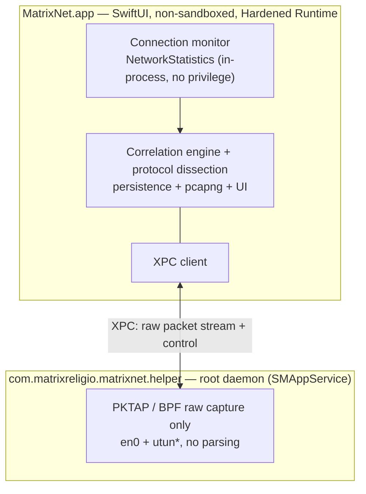

# MatrixNet

[English](./README.md) · [简体中文](./README.zh-CN.md) · [繁體中文](./README.zh-Hant.md) · [日本語](./README.ja.md) · [한국어](./README.ko.md) · [Français](./README.fr.md) · **Deutsch** · [Español](./README.es.md)

**Sehen Sie, welche App mit welcher IP spricht — und verfolgen Sie jeden Datenfluss bis zum Paket.**

Ein zu 100 % nativer SwiftUI-Netzwerkmonitor und Deep-Packet-Analyzer für macOS. So mühelos wie die Aktivitätsanzeige dafür, *wer im Netzwerk ist*, so tiefgehend wie Wireshark dafür, *was über die Leitung geht* — und jedes Paket weiß, welche App es gesendet hat.

[](https://github.com/MatrixReligio/MatrixNet/actions/workflows/ci.yml)
[](./LICENSE)
[](#systemanforderungen)
[](https://swift.org)
[](https://github.com/MatrixReligio/MatrixNet/releases/latest)
[](https://github.com/MatrixReligio/MatrixNet/releases)
[](https://github.com/MatrixReligio/MatrixNet/stargazers)
[](https://github.com/MatrixReligio/MatrixNet/commits/main)
[](#installation)
[](#datenschutz)
[](#datenschutz)

> **100 % passiv — beobachten, niemals blockieren.** MatrixNet liest nur die Kernel-Statistiken und eine Kopie jedes Pakets und läuft daher neben jedem Proxy, Filter oder VPN ohne Konflikt. Keine Firewall, kein Abfangen von Datenverkehr, keine HTTPS-Entschlüsselung.

---

## Was ist MatrixNet?

Seit einem Jahrzehnt beherrschen zwei Werkzeuge das macOS-Netzwerk. **Little Snitch** sagt Ihnen, *welche App* sich wohin verbindet. **Wireshark** zeigt *jedes Byte auf der Leitung* — ohne zu wissen, welche App es erzeugt hat. MatrixNet vereint beides in einer nativen App: oben die Verbindungsüberwachung pro App, darunter die Zerlegung auf Paketebene und eine Korrelationsschicht, die jedes erfasste Paket dem Prozess und der Verbindung zuordnet, zu der es gehört.

MatrixNet ist streng **passiv — beobachten, niemals blockieren**. Keine Firewall, kein Abfangen von Datenverkehr, keine HTTPS-Entschlüsselung. Da es nur beobachtet, läuft MatrixNet neben jedem Proxy, Filter oder VPN, das Sie bereits nutzen, ohne sich damit zu streiten.

## Funktionen

### 🔭 Verbindungsüberwachung
- Ein Live-**Übersichts-Dashboard**: ein Durchsatzdiagramm (letzte Minute), Kennzahlen (aktive Verbindungen, Sitzungssumme, aktive Apps, erreichte Länder, Bedrohungsverbindungen, Anteil über Proxy), eine Protokollverteilung, die wichtigsten Zielländer und eine erweiterte Liste der größten Verursacher.
- Systemweite Live-Verbindungsliste pro App: Prozess, Remote-Host/IP, Land, Up-/Download-Rate, kumulierte Bytes und Verbindungslebenszyklus. Die Ansichten Verbindungen, Verlauf und Nutzung gruppieren standardmäßig nach App — klicken Sie auf eine App, um ihre einzelnen Flows aufzuschlüsseln.
- Vom Kernel zugeordnete Prozesszugehörigkeit — derselbe Mechanismus wie bei `nettop` und der Aktivitätsanzeige — also genaue Zuordnung ohne Polling-Wettläufe.
- Aus den Ports abgeleitete **Client/Server-Rolle** (hat dieser Host die Verbindung aufgebaut oder angenommen?).
- **Proxy- und VPN/Tunnel-Erkennung** — Verbindungen, deren Gegenstelle Ihr konfigurierter oder lokaler Proxy ist, werden markiert, und Prozesse, die den Verkehr anderer Apps weiterleiten (NetworkExtension-Tunnel), erhalten ein Abzeichen, sodass klar ist, wann Verkehr umgeleitet wird. Bei aktiver Paketerfassung zeigt eine Proxy-Verbindung weiterhin ihre echte Domain und ihr Volumen (von der Tunnel-Schnittstelle gelesen), und die Kennzahl „über Proxy“ ist ein Byte-Anteil.
- **Markierung von Bedrohungs-IPs** — Remote-Adressen auf einer öffentlichen Threat-Intelligence-Blockliste werden mit einem ⚠️-Abzeichen gekennzeichnet (nur als Hinweis — MatrixNet kennzeichnet, blockiert nie).
- **Warnungen zu neuen Zielen („phoning home“)** — optional und ohne Blockieren: eine Benachrichtigung, wenn eine bekannte App zum ersten Mal ein Land erreicht, das sie noch nie erreicht hat. Ein Lernfenster pro App und eine Ratenbegrenzung halten es ruhig — der Nutzen einer ausgehenden Firewall, ohne Blockieren oder Benachrichtigungsflut.
- Hostnamen-Anreicherung aus **TLS SNI und DNS** — der exakte Host, den eine App angefragt hat, direkt aus dem ClientHello und den DNS-Antworten gelesen, **ganz ohne Entschlüsselung**, und bevorzugt gegenüber Reverse-DNS-PTR-Einträgen (oft CDN-Wildcards). Ein Umschalter per Klick zeigt **Domainnamen oder rohe IPs** in den Ansichten Verbindungen und Pakete.
- Ein **Karten-Tab** zeichnet einen realweltlichen, offline gepunkteten Globus (Natural Earth, keine Kartenkacheln) mit leuchtenden Bögen von diesem Mac zu jedem Land, mit dem es spricht — Knotengröße nach Verbindungsanzahl, Bedrohungsziele in Rot.
- Ein Verbindungsverlauf zum Zurückblicken („welche App hat sich gestern wohin verbunden“).

### 📊 Verbrauchsberichte
- Ein neuer **Tab „Verbrauch“**, der beantwortet, „wohin meine Bandbreite geflossen ist“: die wichtigsten Apps, Länder und Domains nach Bytes über **Heute / 7 Tage / 30 Tage / deinen Abrechnungszyklus**, mit einem Download-/Upload-Trenddiagramm.
- Basiert auf lokal gespeicherten Stundenbuckets (standardmäßig 90 Tage, konfigurierbar), sodass Summen einen Neustart überstehen — anders als die Aktivitätsanzeige, die auf null zurücksetzt.
- Wähle eine App, um die Länder- und Domain-Aufschlüsselung auf sie zu beschränken, und lege einen **Abrechnungs-Reset-Tag** fest, damit das Fenster „Zyklus“ zu deinem Tarif passt.
- **Exportiere** den aktuellen Zeitraum als CSV oder JSON für Reporting, Abrechnung oder Audit.

### 🔬 Tiefe Paketanalyse
- Erfassung Paket für Paket, bei der **jedes Paket seine besitzende PID trägt**.
- Solide Zerlegung der wichtigsten Protokolle: **Ethernet, IPv4, IPv6, TCP, UDP, ICMP, DNS, TLS (Handshake / SNI / Zertifikat) und HTTP/1.1**.
- **JA4-TLS-Client-Fingerprinting, pro App** —— leite die TLS-Bibliothek jeder App passiv aus dem ClientHello ab (Browser-Engine vs. Go vs. curl vs. verdächtige Bibliothek), ohne Entschlüsselung; angezeigt auf der TLS-Ebene und pro App im Verbindungsinspektor, mit Kennzeichnung erkannter Stacks.
- **HTTP/3- / QUIC-Sichtbarkeit** — entschlüssele das QUIC Initial passiv (öffentliche, aus der DCID abgeleitete Schlüssel nach RFC 9001 — ohne Geheimnis, ohne MITM), um SNI, ALPN und Version jeder HTTP/3-Verbindung zu lesen und ihren QUIC-JA4 zu berechnen, alles pro App.
- **Netzwerkqualität pro App** — passive Messung von TCP-Handshake-RTT, Übertragungswiederholungen und Verbindungsaufbauzeit jeder Verbindung, angezeigt im Verbindungsinspektor (nur bei Erfassung; keine Sonden).
- **Verschlüsseltes DNS pro App** — erkenne, welche Apps noch Klartext-DNS statt DoT, DoQ oder DoH (mit benanntem Resolver) verwenden, klassifiziert aus 5-Tupel und Hostname — ohne Paketerfassung.
- **Aktivitäts-Zeitverlauf pro App** — ein Aktivitätsstreifen je App zeigt aus der gespeicherten Nutzung, wann sie aktiv war (nach Stunde oder Tag) — so fällt Hintergrund-/Nachtaktivität auf.
- Eine Drei-Fenster-Ansicht im Wireshark-Stil: Paketliste, Protokolldetailbaum und synchronisierte Hex-Ansicht.
- „Stream folgen“-Reassemblierung und eine Anzeigefiltersprache zum Eingrenzen der Aufzeichnung.
- Pakete bis auf eine einzelne App oder eine einzelne Verbindung filtern.
- Ausgewählte Pakete oder ganze Sitzungen als **pcapng** exportieren — samt Prozess-Metadaten pro Paket — zur Übergabe an Wireshark.

### 🖥️ Schreibtisch-Widget
- Ein WidgetKit-Widget (klein / mittel / groß) zeigt die Anzahl aktiver Verbindungen, Up-/Download-Durchsatz, Sitzungssummen, die aktivsten Apps und einen Bedrohungszähler — direkt auf dem Schreibtisch oder in der Mitteilungszentrale.
- Es aktualisiert sich live, solange das App-Fenster im Vordergrund ist; im Hintergrund begrenzt macOS die Aktualisierung von Drittanbieter-Widgets auf etwa alle 30 Minuten (WidgetKits Tagesbudget). Für sekundengenaue Raten dient die Menüleiste.

### 🧭 Menüleiste & Hintergrund
- Lebt in der **Menüleiste** mit einer Live-Anzeige des ↓/↑-Durchsatzes und überwacht weiter, nachdem Sie das Hauptfenster geschlossen haben — damit die geteilten Daten, die das Widget liest, auch bei App im Hintergrund aktuell bleiben.
- Ein optionaler **Nur-Menüleisten-Modus** blendet das Dock-Symbol vollständig aus.
- **Beim Anmelden starten** und ein **Einstellungsfenster** (⌘,) für den Hintergrundmodus, Bedrohungsverbindungs-Benachrichtigungen, automatische Updateprüfungen und das manuelle Aktualisieren der Datensätze.
- **Benachrichtigungen zu Bedrohungsverbindungen** — warnen Sie, wenn eine aktive Verbindung eine markierte Adresse erreicht (nur Hinweis; MatrixNet blockiert nie).

### 🌍 Spricht Ihre Sprache
- Vollständig in **8 Sprachen** lokalisiert — Englisch, vereinfachtes und traditionelles Chinesisch, Japanisch, Koreanisch, Französisch, Deutsch und Spanisch — folgt automatisch der macOS-Systemsprache. Die Übersetzungsabdeckung wird in der CI erzwungen.

### 🔄 Immer aktuell
- **In-App-Auto-Update** über [Sparkle](https://sparkle-project.org) mit EdDSA-signierten Updates aus den GitHub-Releases. Auf Wunsch oder täglich im Hintergrund.
- Die **GeoIP-Datenbank aktualisiert sich automatisch** im Hintergrund aus dem monatlichen DB-IP-Datensatz, damit die Länderzuordnung über die Zeit korrekt bleibt. Sie deckt sowohl **IPv4- als auch IPv6**-Ziele ab, sodass die Karte und die Länderkennzahlen den IPv6-Verkehr nicht zu niedrig ausweisen. Wenn ein lokaler Proxy/Tunnel aktiv ist, ist die Ziel-IP ein synthetischer Platzhalter; das Land wird daher aus der echten Domain ermittelt (siehe Datenschutz).
- Die **Bedrohungs-IP-Liste aktualisiert sich genauso automatisch** aus dem öffentlichen IPsum-Aggregat — die App kontaktiert ausschließlich ihre eigene Release-Ressource, nie die Upstream-Feeds.

### 🛡️ Datenschutz & null Konflikte
- **Konfliktfrei per Design.** MatrixNet ist vollständig passiv: kein NetworkExtension, kein exklusiver Routing-/Proxy-Slot, nie im Paketpfad. Es koexistiert mit AdGuard, Surge, Little Snitch, LuLu und jedem VPN.
- **100 % lokal, passive Erfassung.** Die gesamte Paket-/Verbindungsverarbeitung geschieht auf Ihrem Gerät — keine Telemetrie, kein Konto, keine Cloud. Die einzige mögliche Netzwerk-Anfrage ist die optionale GeoIP-Länderauflösung für *Proxy*-Flows (standardmäßig an, über verschlüsseltes DNS/DoH), in den Einstellungen abschaltbar.
- **Geringste Rechte.** Die Verbindungsüberwachung benötigt keinerlei Autorisierung. Die Paketerfassung ist in einem minimalen, reinen Erfassungs-Helfer isoliert; das Parsen nicht vertrauenswürdiger Bytes läuft in der nicht privilegierten App.

## Warum MatrixNet?

| | Little Snitch | Wireshark | **MatrixNet** |
|---|:---:|:---:|:---:|
| Verbindungsansicht pro App | ✅ | ❌ | ✅ |
| Zerlegung auf Paketebene | ❌ | ✅ | ✅ |
| Jedes Paket kennt seine App | ❌ | ❌ | ✅ |
| Verbindung ↔ Paket-Korrelation | ❌ | ❌ | ✅ |
| Koexistiert mit Proxys/VPNs | ⚠️ | ✅ | ✅ |
| Native, leichtgewichtige macOS-App | ✅ | ❌ | ✅ |
| Blockiert/filtert Verkehr | ✅ | ❌ | ❌ (per Design — passiv) |

MatrixNet will keine Firewall ersetzen. Es ist das Werkzeug, zu dem Sie greifen, wenn Sie das Netzwerkverhalten Ihres Rechners *verstehen* wollen — von der Vogelperspektive pro App bis hinab zu den Bytes — ohne sonst etwas im System zu stören.

## Architektur

MatrixNet folgt einem **passiv-zuerst, zweiquelligen** Entwurf (intern „Architektur A′“). Zwei unabhängige passive Quellen werden über 5-Tupel und PID zusammengeführt:

- **Die Verbindungsebene** stammt aus Apples privatem `NetworkStatistics`-Framework (`NStatManager*`) — dem Kernel-Mechanismus hinter `nettop` und der Aktivitätsanzeige. Der Kernel ordnet jede Verbindung einer PID zu und meldet das 5-Tupel und die Byte-Zähler. Das braucht weder root noch ein Entitlement noch NetworkExtension, genau deshalb steht MatrixNet mit nichts in Konflikt.
- **Die Paketebene** stammt aus `PKTAP` (`DLT_PKTAP`) über BPF, das jedes Paket mit seiner Ursprungs-PID markiert. Ist ein VPN aktiv, erfasst MatrixNet sowohl die physische Schnittstelle (`en0`) als auch die Tunnel (`utun*`). Die Rohaufzeichnung erfordert root und liegt daher in einem kleinen privilegierten Helfer, der über `SMAppService` registriert wird. Der Helfer *erfasst nur* — die gesamte Zerlegung nicht vertrauenswürdiger Netzwerkdaten geschieht in der nicht privilegierten Haupt-App.



**Warum kein NetworkExtension?** Unter macOS *erfordert* das Zuordnen von Verkehr zu einem Prozess kein NetworkExtension — der Kernel macht das bereits über `NetworkStatistics`. `NEFilterDataProvider`, `NEPacketTunnelProvider` oder `NEDNSProxyProvider` zu verwenden hieße, um exklusive, umkämpfte Slots im Socket-/Routing-/DNS-Pfad zu konkurrieren — die dokumentierte Quelle von Konflikten zwischen Filterprodukten. Für ein Überwachungswerkzeug erfüllt die passive Kernel-Beobachtung die Konfliktfreiheit perfekt.

Siehe [`docs/ARCHITECTURE.md`](./docs/ARCHITECTURE.md) für den vollständigen Entwurf, den Modulabhängigkeitsgraphen und die Datenflüsse.

## Systemanforderungen

- **macOS 26 (Tahoe)** oder neuer
- Apple Silicon oder Intel
- Zum Bauen aus dem Quellcode: **Xcode 26** und [XcodeGen](https://github.com/yonaskolb/XcodeGen)

## Installation

Laden Sie die notarisierte `.dmg` von der Seite [GitHub Releases](https://github.com/MatrixReligio/MatrixNet/releases) herunter, öffnen Sie sie und ziehen Sie MatrixNet in Ihren Programme-Ordner. Die Builds sind mit einer Developer ID signiert und von Apple notarisiert, daher öffnet Gatekeeper sie ohne Warnungen. Nach der Installation hält sich MatrixNet selbst aktuell — Sie müssen diese Seite nicht erneut aufsuchen.

MatrixNet wird **nicht** über den Mac App Store vertrieben: BPF/PKTAP-Erfassung und das `NetworkStatistics`-Framework stehen Sandbox-Apps nicht zur Verfügung. Die direkte, notarisierte Verteilung ist eine bewusste architektonische Folge, kein Versäumnis.

## Aus dem Quellcode bauen

> Die folgenden Befehle sind Platzhalter und werden **noch finalisiert**, sobald die Build- und Packaging-Skripte vorliegen.

```sh
# 1. Klonen
git clone https://github.com/MatrixReligio/MatrixNet.git
cd MatrixNet

# 2. Die reine Logik-Kern-Testsuite ausführen (kein Xcode nötig)
swift test

# 3. Das Xcode-Projekt erzeugen (App- + privilegierte Helfer-Targets)
xcodegen generate

# 4. Die App bauen / starten
#    (MatrixNet.xcodeproj in Xcode 26 öffnen oder xcodebuild — wird finalisiert)
open MatrixNet.xcodeproj
```

Der reine Logik-Kern (Domänenmodell, Zerlegung, pcapng, Korrelation usw.) ist ein lokales Swift Package und baut und testet sich mit einfachem `swift test`. Die macOS-App und der privilegierte Helfer sind Xcode-Targets, die XcodeGen aus `project.yml` erzeugt. Siehe [`CONTRIBUTING.md`](./CONTRIBUTING.md) für den vollständigen Entwickler-Workflow.

## Berechtigungen

MatrixNet verlangt auf jeder Ebene die *geringsten* Rechte und verschlechtert sich anmutig:

- **Verbindungsüberwachung — keine Autorisierung nötig.** Starten Sie die App und Sie sehen sofort, welche Apps im Netzwerk sind. `NetworkStatistics` läuft in-process, ohne root, Entitlement oder TCC-Abfrage.
- **Tiefe Paketerfassung — einmalige Systemautorisierung.** Die Rohaufzeichnung erfordert root, daher installiert MatrixNet über `SMAppService` einen minimalen, reinen Erfassungs-Helferdienst, der eine einzige Systemfreigabe benötigt. Lehnen Sie ab oder schlägt die Installation fehl, funktionieren alle Verbindungsüberwachungs-Funktionen weiter und nur die Paketerfassung ist deaktiviert (mit Wiederholungsabfrage).

Der Helfer existiert ausschließlich, um die root-Anforderung von BPF/PKTAP zu erfüllen. Er nimmt keinerlei Analyse vor — der Umgang mit nicht vertrauenswürdigen Netzwerk-Bytes bleibt bewusst außerhalb des privilegierten Prozesses.

## Datenschutz

MatrixNet verarbeitet alles lokal — keine Telemetrie, kein Konto, keine Cloud. Die einzige mögliche Netzwerk-Anfrage ist die optionale GeoIP-Länderauflösung für Proxy-Flows (standardmäßig an): Wenn ein lokaler Proxy die echte Adresse verbirgt, wird die Domain über verschlüsseltes DNS (DoH) aufgelöst, um das Land zu ermitteln; in den Einstellungen abschaltbar, damit keine Daten Ihr Gerät verlassen. Aufzeichnungen, Verlauf und Einstellungen liegen nur auf Ihrer Festplatte.

## Versionierung

MatrixNet folgt der [Semantischen Versionierung](https://semver.org/lang/de/): **MAJOR.MINOR.PATCH**.

- **MAJOR** — inkompatible Änderungen oder eine grundlegende Neuausrichtung der App.
- **MINOR** — neue, abwärtskompatible Funktionen.
- **PATCH** — abwärtskompatible Fehlerbehebungen.

Jede Version wird notariell beglaubigt und über das integrierte Update verteilt. Siehe [CHANGELOG](./CHANGELOG.md) für die Änderungen jeder Version.

## Mitwirken

Beiträge sind willkommen. MatrixNet wird test-first gebaut, mit strikter Nebenläufigkeit, SwiftLint/SwiftFormat und Conventional Commits. Bitte lesen Sie [`CONTRIBUTING.md`](./CONTRIBUTING.md), bevor Sie einen Pull Request öffnen, und beachten Sie unseren [Verhaltenskodex](./CODE_OF_CONDUCT.md).

Sicherheitsprobleme bitte privat melden — siehe [`SECURITY.md`](./SECURITY.md).

## Lizenz

Lizenziert unter der [Apache License 2.0](./LICENSE). Copyright 2026 MatrixReligio LLC. Siehe [`NOTICE`](./NOTICE) für Danksagungen.

## Danksagungen

MatrixNet steht auf den Schultern der Werkzeuge, die Netzwerktransparenz zur Norm gemacht haben. Dank an die Projekte **Wireshark** und **tcpdump/libpcap** für Jahrzehnte an Protokollzerlegung und Erfassung sowie an **Little Snitch** und **LuLu** dafür, zu zeigen, wie netzwerkbezogenes Bewusstsein pro App unter macOS aussehen kann.

Mitgelieferte Daten: Länder-Geolokalisierung von [DB-IP](https://db-ip.com) (CC-BY-4.0), die Bedrohungs-IP-Liste abgeleitet aus [IPsum](https://github.com/stamparm/ipsum) (gemeinfrei) und die Weltgeometrie des Karten-Tabs aus [Natural Earth](https://www.naturalearthdata.com) (gemeinfrei). Siehe [`NOTICE`](./NOTICE) für vollständige Danksagungen.

---

Fragen oder Feedback: [contact@matrixreligio.com](mailto:contact@matrixreligio.com)
