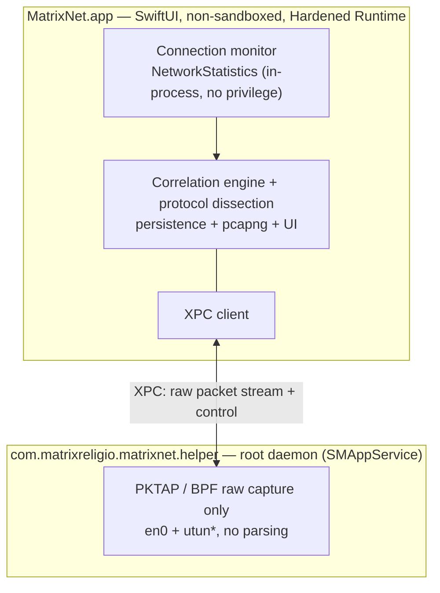

# MatrixNet

[English](./README.md) · [简体中文](./README.zh-CN.md) · [繁體中文](./README.zh-Hant.md) · [日本語](./README.ja.md) · [한국어](./README.ko.md) · [Français](./README.fr.md) · [Deutsch](./README.de.md) · **Español**

**Vea qué app habla con qué IP — y luego baje cualquier flujo hasta el paquete.**

Un monitor de red y analizador de paquetes en profundidad para macOS, 100 % nativo en SwiftUI. Tan sencillo como el Monitor de Actividad para saber *quién está en la red*, tan profundo como Wireshark para *qué circula por el cable* — y cada paquete sabe qué app lo envió.

[](https://github.com/MatrixReligio/MatrixNet/actions/workflows/ci.yml)
[](./LICENSE)
[](#requisitos)
[](https://swift.org)
[](https://github.com/MatrixReligio/MatrixNet/releases/latest)
[](https://github.com/MatrixReligio/MatrixNet/releases)
[](https://github.com/MatrixReligio/MatrixNet/stargazers)
[](https://github.com/MatrixReligio/MatrixNet/commits/main)
[](#instalación)
[](#privacidad)
[](#privacidad)

> **100 % pasivo — observar, nunca bloquear.** MatrixNet solo lee las estadísticas del kernel y una copia de cada paquete, por lo que funciona junto a cualquier proxy, filtro o VPN sin conflictos. Sin cortafuegos, sin interceptación de tráfico y sin descifrado HTTPS.

---

## ¿Qué es MatrixNet?

Durante una década, dos herramientas han dominado la red en macOS. **Little Snitch** te dice *qué app* se conecta a dónde. **Wireshark** muestra *cada byte en el cable* — pero sin saber qué app lo produjo. MatrixNet une ambas en una sola app nativa: arriba, la supervisión de conexiones por app; debajo, la disección a nivel de paquete; y una capa de correlación que vincula cada paquete capturado con el proceso y la conexión a los que pertenece.

MatrixNet es estrictamente **pasivo — observar, nunca bloquear**. Sin cortafuegos, sin interceptación de tráfico y sin descifrado HTTPS. Como solo observa, MatrixNet funciona junto al proxy, filtro o VPN que ya uses, sin pelearse con ellos.

## Funciones

### 🔭 Supervisión de conexiones
- Un **panel de Resumen** en vivo: gráfico de rendimiento (último minuto), métricas clave (conexiones activas, total de la sesión, apps activas, países alcanzados, conexiones de amenaza, porcentaje vía proxy), un desglose de protocolos, los principales países de destino y una lista enriquecida de los que más consumen.
- Lista de conexiones en vivo a nivel de sistema y por app: proceso, host/IP remoto, país, velocidad de subida/bajada, bytes acumulados y ciclo de vida de la conexión.
- Atribución de procesos por el núcleo — el mismo mecanismo que usan `nettop` y el Monitor de Actividad — para una atribución exacta sin carreras de sondeo.
- **Rol cliente/servidor** inferido de los puertos (¿este host inició o aceptó la conexión?).
- **Conciencia de proxy y VPN/túnel** — las conexiones cuyo remoto es tu proxy configurado o local se marcan, y los procesos que retransmiten el tráfico de otras apps (túneles de NetworkExtension) llevan una insignia, para ver claramente cuándo se enruta el tráfico.
- **Marcado de IP de amenaza** — las direcciones remotas en una lista pública de inteligencia de amenazas se señalan con una insignia ⚠️ (solo informativo — MatrixNet etiqueta, nunca bloquea).
- **Alertas de nuevo destino («phoning home»)** — opcionales y sin bloqueo: una notificación cuando una app conocida alcanza por primera vez un país al que nunca había llegado. Una ventana de aprendizaje por app y la limitación de frecuencia la mantienen discreta — la utilidad de un cortafuegos de salida, sin el bloqueo ni la avalancha de avisos.
- Enriquecimiento de nombres de host mediante **TLS SNI y DNS** — el host exacto que solicitó una app, leído directamente del ClientHello y de las respuestas DNS **sin ningún descifrado**, y preferido frente a los registros PTR de DNS inverso (a menudo comodines de CDN). Un interruptor de un clic muestra **nombres de dominio o IP en crudo** en las vistas de Conexiones y Paquetes.
- Una **pestaña Mapa** dibuja un globo punteado del mundo real, sin conexión (Natural Earth, sin teselas de mapa), con arcos luminosos desde este Mac hacia cada país con el que habla — el tamaño del nodo según el número de conexiones, los destinos de amenaza en rojo.
- Un historial de conexiones para revisar («qué app se conectó a dónde ayer»).

### 📊 Informes de uso
- Una nueva **pestaña Uso** que responde a «¿adónde se fue mi ancho de banda?»: las apps, países y dominios con más bytes en **Hoy / 7 días / 30 días / tu ciclo de facturación**, con un gráfico de tendencia de descarga/subida.
- Se construye a partir de cubos por hora guardados localmente (90 días por omisión, configurable), de modo que los totales sobreviven al reinicio, a diferencia del Monitor de Actividad, que vuelve a cero.
- Selecciona una app para acotar los desgloses por país y dominio a esa app, y define un **día de reinicio del ciclo** para que la ventana «Ciclo» coincida con tu plan.
- **Exporta** el periodo actual como CSV o JSON para informes, facturación o auditoría.

### 🔬 Análisis profundo de paquetes
- Captura paquete a paquete donde **cada paquete lleva su PID propietario**.
- Disección sólida de los protocolos más importantes: **Ethernet, IPv4, IPv6, TCP, UDP, ICMP, DNS, TLS (handshake / SNI / certificado) y HTTP/1.1**.
- **Huella de cliente TLS JA4, por app** —— deduce de forma pasiva la pila TLS de cada app a partir del ClientHello (motor de navegador, Go, curl, biblioteca sospechosa) sin descifrado; se muestra en la capa TLS y por app en el inspector de conexiones, con las pilas reconocidas etiquetadas.
- **Visibilidad de HTTP/3 / QUIC** — descifra de forma pasiva el QUIC Initial (claves públicas derivadas del DCID, RFC 9001 — sin secreto ni MITM) para leer el SNI, el ALPN y la versión de cada conexión HTTP/3, y calcular su JA4 de QUIC, todo por app.
- **Calidad de red por app** — mide de forma pasiva el RTT de handshake TCP, las retransmisiones y el tiempo de establecimiento de cada conexión, mostrado en el inspector de conexiones (solo con captura; sin sondas).
- **DNS cifrado por app** — descubre qué apps siguen usando DNS en texto plano frente a DoT, DoQ o DoH (con el resolver identificado), clasificado a partir de la 5-tupla y el nombre de host — sin captura de paquetes.
- **Cronología de actividad por app** — una franja por app muestra cuándo estuvo activa (por hora o día) a partir del uso almacenado, para que destaque la actividad en segundo plano o nocturna.
- Una vista de tres paneles al estilo Wireshark: lista de paquetes, árbol de detalle de protocolos y hexadecimal sincronizado.
- Reensamblado «Seguir flujo» y un lenguaje de filtros de visualización para acotar la captura.
- Filtrar paquetes hasta una sola app o una sola conexión.
- Exportar paquetes seleccionados o sesiones enteras a **pcapng** — incluyendo metadatos de proceso por paquete — para pasarlos a Wireshark.

### 🖥️ Widget de escritorio
- Un widget de WidgetKit (pequeño / mediano / grande) muestra en vivo el número de conexiones activas, el rendimiento de subida/bajada, los totales de la sesión, las apps más activas y un recuento de amenazas — en el escritorio o en el Centro de notificaciones.

### 🧭 Barra de menús y segundo plano
- Vive en la **barra de menús** con una lectura en vivo del rendimiento ↓/↑, y sigue supervisando tras cerrar la ventana principal — para que el widget de escritorio nunca quede desactualizado.
- Un **modo solo barra de menús** opcional oculta por completo el icono del Dock.
- **Abrir al iniciar sesión** y una **ventana de Ajustes** (⌘,) para el modo en segundo plano, las notificaciones de conexiones de amenaza, la búsqueda automática de actualizaciones y la actualización a demanda de los conjuntos de datos.
- **Notificaciones de conexiones de amenaza** — te avisan cuando una conexión activa alcanza una dirección marcada (solo informativo; MatrixNet nunca bloquea).

### 🌍 Habla tu idioma
- Totalmente localizado en **8 idiomas** — inglés, chino simplificado y tradicional, japonés, coreano, francés, alemán y español — siguiendo automáticamente el idioma del sistema de macOS. La cobertura de traducción se verifica en CI.

### 🔄 Siempre al día
- **Actualización automática integrada** mediante [Sparkle](https://sparkle-project.org), con actualizaciones firmadas con EdDSA servidas desde las Releases de GitHub. A demanda o a diario en segundo plano.
- La **base de datos GeoIP se actualiza automáticamente** en segundo plano desde el conjunto de datos mensual de DB-IP, para que la atribución por país siga siendo precisa con el tiempo. Cubre destinos tanto **IPv4 como IPv6**, de modo que el mapa y las métricas por país no subestiman el tráfico IPv6.
- La **lista de IP de amenaza se actualiza automáticamente** del mismo modo, desde el agregado público IPsum — la app solo contacta con su propio recurso de versión, nunca con las fuentes upstream.

### 🛡️ Privacidad y cero conflictos
- **Cero conflictos por diseño.** MatrixNet es totalmente pasivo: no usa NetworkExtension, no reclama una ranura exclusiva de enrutamiento/proxy y nunca se sitúa en la ruta de los paquetes. Coexiste con AdGuard, Surge, Little Snitch, LuLu y cualquier VPN.
- **100 % local.** Todo el procesamiento ocurre en tu máquina. Ningún dato sale del dispositivo. Sin telemetría. Sin cuenta. Sin nube.
- **Mínimo privilegio.** La supervisión de conexiones no necesita ninguna autorización. La captura de paquetes está aislada en un ayudante mínimo solo de captura; el análisis de bytes no confiables se ejecuta en la app sin privilegios.

## ¿Por qué MatrixNet?

| | Little Snitch | Wireshark | **MatrixNet** |
|---|:---:|:---:|:---:|
| Vista de conexiones por app | ✅ | ❌ | ✅ |
| Disección a nivel de paquete | ❌ | ✅ | ✅ |
| Cada paquete conoce su app | ❌ | ❌ | ✅ |
| Correlación conexión ↔ paquete | ❌ | ❌ | ✅ |
| Coexiste con proxys/VPN | ⚠️ | ✅ | ✅ |
| App de macOS nativa y ligera | ✅ | ❌ | ✅ |
| Bloquea/filtra tráfico | ✅ | ❌ | ❌ (por diseño — pasivo) |

MatrixNet no pretende reemplazar a un cortafuegos. Es la herramienta a la que acudes cuando quieres *entender* el comportamiento de red de tu máquina — desde una vista a vista de pájaro por app hasta los bytes — sin perturbar nada más en el sistema.

## Arquitectura

MatrixNet sigue un diseño **pasivo primero, de doble fuente** (internamente «Arquitectura A′»). Dos fuentes pasivas independientes se fusionan por 5-tupla y PID:

- **El nivel de conexión** proviene del framework privado `NetworkStatistics` de Apple (`NStatManager*`) — el mecanismo del núcleo detrás de `nettop` y el Monitor de Actividad. El núcleo atribuye cada conexión a un PID e informa de la 5-tupla y los contadores de bytes. No necesita root, ni entitlement, ni NetworkExtension, que es precisamente por lo que MatrixNet no entra en conflicto con nada.
- **El nivel de paquete** proviene de `PKTAP` (`DLT_PKTAP`) sobre BPF, que etiqueta cada paquete con su PID de origen. Cuando hay un VPN activo, MatrixNet captura tanto la interfaz física (`en0`) como los túneles (`utun*`). La captura en crudo requiere root, así que vive en un pequeño ayudante privilegiado registrado mediante `SMAppService`. El ayudante *solo captura* — toda la disección de datos de red no confiables ocurre de vuelta en la app principal sin privilegios.



**¿Por qué no NetworkExtension?** En macOS, atribuir el tráfico a un proceso *no* requiere NetworkExtension — el núcleo ya lo hace mediante `NetworkStatistics`. Usar `NEFilterDataProvider`, `NEPacketTunnelProvider` o `NEDNSProxyProvider` significaría competir por ranuras exclusivas y disputadas en la ruta de socket/enrutamiento/DNS, la causa documentada de los conflictos entre productos de filtrado. Para una herramienta de supervisión, la observación pasiva del núcleo satisface a la perfección el requisito de cero conflictos.

Consulta [`docs/ARCHITECTURE.md`](./docs/ARCHITECTURE.md) para el diseño completo, el grafo de dependencias de módulos y los flujos de datos.

## Requisitos

- **macOS 26 (Tahoe)** o posterior
- Apple Silicon o Intel
- Para compilar desde el código fuente: **Xcode 26** y [XcodeGen](https://github.com/yonaskolb/XcodeGen)

## Instalación

Descarga el `.dmg` notarizado desde la página de [Releases de GitHub](https://github.com/MatrixReligio/MatrixNet/releases), ábrelo y arrastra MatrixNet a tu carpeta Aplicaciones. Las compilaciones están firmadas con un Developer ID y notarizadas por Apple, así que Gatekeeper las abre sin avisos. Una vez instalado, MatrixNet se mantiene actualizado por sí mismo — no necesitas volver a esta página.

MatrixNet **no** se distribuye a través de la Mac App Store: la captura BPF/PKTAP y el framework `NetworkStatistics` no están disponibles para apps en espacio aislado. La distribución directa y notarizada es una consecuencia arquitectónica deliberada, no un descuido.

## Compilar desde el código fuente

> Los comandos exactos de abajo son provisionales y **se finalizarán** a medida que lleguen los scripts de compilación y empaquetado.

```sh
# 1. Clonar
git clone https://github.com/MatrixReligio/MatrixNet.git
cd MatrixNet

# 2. Ejecutar la suite de tests del núcleo de lógica pura (sin Xcode)
swift test

# 3. Generar el proyecto de Xcode (objetivos de App + ayudante privilegiado)
xcodegen generate

# 4. Compilar / ejecutar la app
#    (abrir MatrixNet.xcodeproj en Xcode 26, o usar xcodebuild — por finalizar)
open MatrixNet.xcodeproj
```

El núcleo de lógica pura (modelo de dominio, disección, pcapng, correlación, etc.) es un Swift Package local, así que se compila y prueba con un simple `swift test`. La app de macOS y el ayudante privilegiado son objetivos de Xcode generados por XcodeGen a partir de `project.yml`. Consulta [`CONTRIBUTING.md`](./CONTRIBUTING.md) para el flujo de desarrollo completo.

## Permisos

MatrixNet pide el *menor* privilegio en cada nivel y se degrada con elegancia:

- **Supervisión de conexiones — sin autorización requerida.** Inicia la app y verás de inmediato qué apps están en la red. `NetworkStatistics` se ejecuta in-process, sin root, entitlement ni aviso de TCC.
- **Captura profunda de paquetes — autorización del sistema una sola vez.** La captura en crudo requiere root, así que MatrixNet instala un ayudante mínimo solo de captura mediante `SMAppService`, que requiere una única aprobación del sistema. Si la rechazas o la instalación falla, todas las funciones de supervisión de conexiones siguen funcionando y solo se desactiva la captura de paquetes (con un aviso para reintentar).

El ayudante existe únicamente para satisfacer el requisito de root de BPF/PKTAP. No hace ningún análisis — manejar bytes de red no confiables se mantiene a propósito fuera del proceso privilegiado.

## Privacidad

MatrixNet procesa todo localmente. No envía ningún dato fuera de tu máquina, no tiene telemetría, no requiere cuenta y no habla con ningún servidor. Las capturas, el historial y los ajustes solo viven en tu disco.

## Versionado

MatrixNet sigue el [versionado semántico](https://semver.org/lang/es/): **MAYOR.MENOR.PARCHE**.

- **MAYOR** — cambios incompatibles o un giro fundamental en la app.
- **MENOR** — nuevas funciones retrocompatibles.
- **PARCHE** — correcciones de errores retrocompatibles.

Cada versión se notariza y se distribuye mediante la actualización integrada. Consulta el [CHANGELOG](./CHANGELOG.md) para ver los cambios de cada versión.

## Contribuir

Las contribuciones son bienvenidas. MatrixNet se construye con test-first, concurrencia estricta, SwiftLint/SwiftFormat y Conventional Commits. Lee [`CONTRIBUTING.md`](./CONTRIBUTING.md) antes de abrir una pull request y ten en cuenta nuestro [Código de conducta](./CODE_OF_CONDUCT.md).

Los problemas de seguridad deben informarse en privado — consulta [`SECURITY.md`](./SECURITY.md).

## Licencia

Bajo la licencia [Apache License 2.0](./LICENSE). Copyright 2026 MatrixReligio LLC. Consulta [`NOTICE`](./NOTICE) para las atribuciones.

## Agradecimientos

MatrixNet se apoya en los hombros de las herramientas que hicieron de la transparencia de red una norma. Gracias a los proyectos **Wireshark** y **tcpdump/libpcap** por décadas de trabajo de disección y captura de protocolos, y a **Little Snitch** y **LuLu** por mostrar lo que puede ser la conciencia de red por app en macOS.

Datos incluidos: geolocalización por país de [DB-IP](https://db-ip.com) (CC-BY-4.0), la lista de IP de amenaza derivada de [IPsum](https://github.com/stamparm/ipsum) (dominio público) y la geometría mundial de la pestaña Mapa de [Natural Earth](https://www.naturalearthdata.com) (dominio público). Consulta [`NOTICE`](./NOTICE) para las atribuciones completas.

---

Preguntas o comentarios: [contact@matrixreligio.com](mailto:contact@matrixreligio.com)
