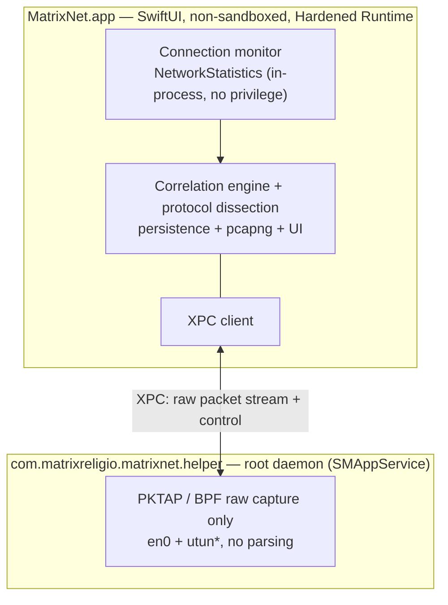

# MatrixNet

[English](./README.md) · [简体中文](./README.zh-CN.md) · [繁體中文](./README.zh-Hant.md) · [日本語](./README.ja.md) · [한국어](./README.ko.md) · **Français** · [Deutsch](./README.de.md) · [Español](./README.es.md)

**Voyez quelle app parle à quelle IP — puis descendez n'importe quel flux jusqu'au paquet.**

Un moniteur réseau et analyseur de paquets approfondi pour macOS, 100 % natif SwiftUI. Aussi simple que le Moniteur d'activité pour savoir *qui est sur le réseau*, aussi profond que Wireshark pour *ce qui circule sur le fil* — et chaque paquet sait quelle app l'a envoyé.

[](https://github.com/MatrixReligio/MatrixNet/actions/workflows/ci.yml)
[](./LICENSE)
[](#configuration-requise)
[](https://swift.org)
[](https://github.com/MatrixReligio/MatrixNet/releases/latest)
[](https://github.com/MatrixReligio/MatrixNet/releases)
[](https://github.com/MatrixReligio/MatrixNet/stargazers)
[](https://github.com/MatrixReligio/MatrixNet/commits/main)
[](#installation)
[](#confidentialité)
[](#confidentialité)

> **100 % passif — observer, jamais bloquer.** MatrixNet ne lit que les statistiques du noyau et une copie de chaque paquet ; il fonctionne donc aux côtés de n'importe quel proxy, filtre ou VPN sans conflit. Pas de pare-feu, pas d'interception du trafic, pas de déchiffrement HTTPS.

---

## Qu'est-ce que MatrixNet ?

Depuis une décennie, deux outils règnent sur le réseau macOS. **Little Snitch** vous dit *quelle app* se connecte où. **Wireshark** montre *chaque octet sur le fil* — sans savoir quelle app l'a produit. MatrixNet réunit les deux dans une seule app native : la surveillance des connexions par app au-dessus, la dissection au niveau paquet en dessous, et une couche de corrélation qui relie chaque paquet capturé au processus et à la connexion auxquels il appartient.

MatrixNet est strictement **passif — observer, jamais bloquer**. Pas de pare-feu, pas d'interception du trafic, pas de déchiffrement HTTPS. Comme il se contente d'observer, MatrixNet fonctionne aux côtés du proxy, du filtre ou du VPN que vous utilisez déjà, sans les gêner.

## Fonctionnalités

### 🔭 Surveillance des connexions
- Un **tableau de bord Aperçu** en direct : graphe de débit (dernière minute), indicateurs clés (connexions actives, total de session, apps actives, pays atteints, connexions à risque, part via proxy), répartition des protocoles, principaux pays de destination et une liste enrichie des plus gros consommateurs.
- Liste des connexions en direct à l'échelle du système, par app : processus, hôte/IP distant, pays, débit montant/descendant, octets cumulés et cycle de vie de la connexion.
- Attribution des processus par le noyau — le même mécanisme que `nettop` et le Moniteur d'activité — donc une attribution exacte sans course au polling.
- **Rôle client/serveur** déduit des ports (cet hôte a-t-il initié ou accepté la connexion ?).
- **Conscience des proxys et VPN/tunnels** — les connexions dont le distant est votre proxy configuré ou local sont signalées, et les processus qui relaient le trafic d'autres apps (tunnels NetworkExtension) portent un badge, pour voir clairement quand le trafic est routé.
- **Marquage des IP à risque** — les adresses distantes figurant sur une liste publique de renseignement de menaces sont signalées par un badge ⚠️ (à titre indicatif — MatrixNet étiquette, ne bloque jamais).
- **Alertes de nouvelle destination (« phoning home »)** — facultatives et sans blocage : une notification lorsqu'une app connue atteint pour la première fois un pays jamais atteint auparavant. Une fenêtre d'apprentissage par app et une limitation de débit la gardent discrète — l'intérêt d'un pare-feu sortant, sans le blocage ni le déluge d'alertes.
- Enrichissement des noms d'hôtes via **TLS SNI et DNS** — l'hôte exact demandé par une app, lu directement dans le ClientHello et les réponses DNS **sans aucun déchiffrement**, et préféré aux enregistrements PTR de DNS inverse (souvent des jokers CDN). Une bascule en un clic affiche **noms de domaine ou IP brutes** dans les vues Connexions et Paquets.
- Un **onglet Carte** dessine un globe pointillé du monde réel, hors ligne (Natural Earth, sans tuiles), avec des arcs lumineux de ce Mac vers chaque pays auquel il parle — taille des nœuds selon le nombre de connexions, destinations à risque en rouge.
- Un historique des connexions consultable (« quelle app s'est connectée où hier »).

### 📊 Rapports d’utilisation
- Un nouvel **onglet Utilisation** qui répond à « où est passée ma bande passante » : les principales apps, pays et domaines par octets sur **Aujourd’hui / 7 jours / 30 jours / votre cycle de facturation**, avec un graphique de tendance téléchargement/téléversement.
- Construit à partir de compartiments horaires conservés localement (90 jours par défaut, configurable), les totaux survivent au redémarrage — contrairement au Moniteur d’activité, qui repart de zéro.
- Sélectionnez une app pour limiter les répartitions par pays et par domaine à celle-ci, et définissez un **jour de réinitialisation du cycle** pour que la fenêtre « Cycle » corresponde à votre forfait.
- **Exportez** la période en cours en CSV ou JSON pour le reporting, la facturation ou l'audit.

### 🔬 Analyse approfondie des paquets
- Capture paquet par paquet où **chaque paquet porte le PID propriétaire**.
- Dissection solide des protocoles les plus importants : **Ethernet, IPv4, IPv6, TCP, UDP, ICMP, DNS, TLS (handshake / SNI / certificat) et HTTP/1.1**.
- **Empreinte client TLS JA4, par app** —— déduisez passivement la pile TLS de chaque app à partir du ClientHello (moteur de navigateur, Go, curl, bibliothèque suspecte) sans déchiffrement ; affichée sur la couche TLS et par app dans l'inspecteur de connexion, les piles reconnues étant étiquetées.
- **Visibilité HTTP/3 / QUIC** — déchiffrez passivement le QUIC Initial (clés publiques dérivées du DCID, RFC 9001 — sans secret ni MITM) pour lire le SNI, l'ALPN et la version de chaque connexion HTTP/3, et calculer son JA4 QUIC, le tout par app.
- **Qualité réseau par app** — mesure passive du RTT de handshake TCP, des retransmissions et du temps d'établissement de chaque connexion, affichée dans l'inspecteur de connexions (capture uniquement ; aucune sonde).
- **DNS chiffré par app** — repérez les apps qui utilisent encore le DNS en clair plutôt que DoT, DoQ ou DoH (avec le résolveur nommé), classé à partir du 5-tuple et du nom d'hôte — sans capture de paquets.
- Une vue à trois volets façon Wireshark : liste des paquets, arbre de détail des protocoles et hexa synchronisé.
- Réassemblage Suivre le flux et un langage de filtres d'affichage pour découper la capture.
- Filtrage des paquets jusqu'à une seule app ou une seule connexion.
- Export des paquets sélectionnés ou de sessions entières en **pcapng** — avec les métadonnées de processus par paquet — pour les passer à Wireshark.

### 🖥️ Widget de bureau
- Un widget WidgetKit (petit / moyen / grand) affiche en direct le nombre de connexions actives, le débit montant/descendant, les totaux de session, les apps les plus actives et un compteur de menaces — sur le bureau ou dans le centre de notifications.

### 🧭 Barre des menus et arrière-plan
- Présent dans la **barre des menus** avec un débit ↓/↑ en direct, et continue de surveiller après la fermeture de la fenêtre principale — pour que le widget ne soit jamais obsolète.
- Un **mode barre des menus uniquement** optionnel masque entièrement l'icône du Dock.
- **Lancement à l'ouverture de session** et une **fenêtre Réglages** (⌘,) pour le mode arrière-plan, les notifications de connexions à risque, la recherche automatique de mises à jour et l'actualisation à la demande des jeux de données.
- **Notifications de connexions à risque** — vous alertent quand une connexion active atteint une adresse signalée (à titre indicatif ; MatrixNet ne bloque jamais).

### 🌍 Parle votre langue
- Entièrement localisé en **8 langues** — anglais, chinois simplifié et traditionnel, japonais, coréen, français, allemand et espagnol — en suivant automatiquement la langue système de macOS. La couverture des traductions est vérifiée en CI.

### 🔄 Toujours à jour
- **Mise à jour automatique intégrée** via [Sparkle](https://sparkle-project.org), avec des mises à jour signées EdDSA servies depuis les Releases GitHub. À la demande ou en arrière-plan chaque jour.
- La **base GeoIP s'actualise automatiquement** en arrière-plan depuis le jeu de données mensuel DB-IP, pour que l'attribution par pays reste juste dans le temps.
- La **liste d'IP à risque s'actualise automatiquement** de la même façon, depuis l'agrégat public IPsum — l'app ne contacte jamais que sa propre ressource de version, jamais les flux en amont.

### 🛡️ Confidentialité et zéro conflit
- **Zéro conflit par conception.** MatrixNet est entièrement passif : aucun NetworkExtension, aucune réservation exclusive de routage/proxy, jamais sur le chemin des paquets. Il coexiste avec AdGuard, Surge, Little Snitch, LuLu et tout VPN.
- **100 % local.** Tout le traitement a lieu sur votre machine. Aucune donnée ne quitte l'appareil. Pas de télémétrie. Pas de compte. Pas de cloud.
- **Moindre privilège.** La surveillance des connexions ne demande aucune autorisation. La capture de paquets est isolée dans un assistant minimal dédié à la capture ; l'analyse des octets non fiables s'exécute dans l'app non privilégiée.

## Pourquoi MatrixNet ?

| | Little Snitch | Wireshark | **MatrixNet** |
|---|:---:|:---:|:---:|
| Vue des connexions par app | ✅ | ❌ | ✅ |
| Dissection au niveau paquet | ❌ | ✅ | ✅ |
| Chaque paquet connaît son app | ❌ | ❌ | ✅ |
| Corrélation connexion ↔ paquet | ❌ | ❌ | ✅ |
| Coexiste avec proxys/VPN | ⚠️ | ✅ | ✅ |
| App macOS native et légère | ✅ | ❌ | ✅ |
| Bloque/filtre le trafic | ✅ | ❌ | ❌ (par conception — passif) |

MatrixNet ne cherche pas à remplacer un pare-feu. C'est l'outil vers lequel se tourner pour *comprendre* le comportement réseau de sa machine — d'une vue d'ensemble par app jusqu'aux octets — sans perturber le reste du système.

## Architecture

MatrixNet suit une conception **passive d'abord, à double source** (appelée en interne « Architecture A′ »). Deux sources passives indépendantes sont fusionnées par 5-uplet et PID :

- **Le niveau connexion** provient du framework privé `NetworkStatistics` d'Apple (`NStatManager*`) — le mécanisme noyau derrière `nettop` et le Moniteur d'activité. Le noyau attribue chaque connexion à un PID et rapporte le 5-uplet et les compteurs d'octets. Cela ne demande ni root, ni entitlement, ni NetworkExtension, ce qui explique précisément pourquoi MatrixNet n'entre en conflit avec rien.
- **Le niveau paquet** provient de `PKTAP` (`DLT_PKTAP`) au-dessus de BPF, qui étiquette chaque paquet avec son PID d'origine. Quand un VPN est actif, MatrixNet capture à la fois l'interface physique (`en0`) et le(s) tunnel(s) (`utun*`). La capture brute exige root, elle vit donc dans un petit assistant privilégié enregistré via `SMAppService`. L'assistant *ne fait que capturer* — toute la dissection des données réseau non fiables se passe dans l'app principale non privilégiée.



**Pourquoi pas de NetworkExtension ?** Sur macOS, attribuer le trafic à un processus *ne nécessite pas* NetworkExtension — le noyau le fait déjà via `NetworkStatistics`. Utiliser `NEFilterDataProvider`, `NEPacketTunnelProvider` ou `NEDNSProxyProvider` reviendrait à se disputer des emplacements exclusifs et contestés dans le chemin socket/routage/DNS, source documentée des conflits entre produits de filtrage. Pour un outil de surveillance, l'observation passive du noyau satisfait parfaitement l'exigence de zéro conflit.

Voir [`docs/ARCHITECTURE.md`](./docs/ARCHITECTURE.md) pour la conception complète, le graphe de dépendances des modules et les flux de données.

## Configuration requise

- **macOS 26 (Tahoe)** ou ultérieur
- Apple Silicon ou Intel
- Pour compiler depuis les sources : **Xcode 26** et [XcodeGen](https://github.com/yonaskolb/XcodeGen)

## Installation

Téléchargez le `.dmg` notarié depuis la page des [Releases GitHub](https://github.com/MatrixReligio/MatrixNet/releases), ouvrez-le et glissez MatrixNet dans votre dossier Applications. Les builds sont signés avec un Developer ID et notariés par Apple, donc Gatekeeper les ouvre sans avertissement. Une fois installé, MatrixNet se maintient à jour — inutile de revenir sur cette page.

MatrixNet **n'est pas** distribué via le Mac App Store : la capture BPF/PKTAP et le framework `NetworkStatistics` ne sont pas disponibles pour les apps en bac à sable. La distribution directe et notariée est une conséquence architecturale délibérée, pas un oubli.

## Compiler depuis les sources

> Les commandes ci-dessous sont des espaces réservés et **seront finalisées** à mesure que les scripts de build et d'empaquetage arrivent.

```sh
# 1. Cloner
git clone https://github.com/MatrixReligio/MatrixNet.git
cd MatrixNet

# 2. Lancer la suite de tests du cœur logique pur (sans Xcode)
swift test

# 3. Générer le projet Xcode (cibles App + assistant privilégié)
xcodegen generate

# 4. Compiler / lancer l'app
#    (ouvrir MatrixNet.xcodeproj dans Xcode 26, ou utiliser xcodebuild — à finaliser)
open MatrixNet.xcodeproj
```

Le cœur logique pur (modèle de domaine, dissection, pcapng, corrélation, etc.) est un Swift Package local : il se compile et se teste avec un simple `swift test`. L'app macOS et l'assistant privilégié sont des cibles Xcode générées par XcodeGen depuis `project.yml`. Voir [`CONTRIBUTING.md`](./CONTRIBUTING.md) pour le flux de développement complet.

## Autorisations

MatrixNet demande le *moindre* privilège à chaque niveau et se dégrade en douceur :

- **Surveillance des connexions — aucune autorisation requise.** Lancez l'app et vous voyez immédiatement quelles apps sont sur le réseau. `NetworkStatistics` s'exécute in-process, sans root, entitlement ni invite TCC.
- **Capture approfondie des paquets — une autorisation système unique.** La capture brute exige root, donc MatrixNet installe un assistant minimal dédié à la capture via `SMAppService`, ce qui requiert une seule approbation système. Si vous refusez ou si l'installation échoue, toutes les fonctions de surveillance des connexions continuent de marcher et seule la capture de paquets est désactivée (avec une invite de nouvelle tentative).

L'assistant existe uniquement pour satisfaire l'exigence root de BPF/PKTAP. Il ne fait aucune analyse — traiter des octets réseau non fiables reste volontairement hors du processus privilégié.

## Confidentialité

MatrixNet traite tout localement. Il n'envoie aucune donnée hors de votre machine, n'a pas de télémétrie, ne requiert aucun compte et ne parle à aucun serveur. Captures, historique et réglages ne vivent que sur votre disque.

## Gestion des versions

MatrixNet suit le [versionnage sémantique](https://semver.org/lang/fr/) : **MAJEUR.MINEUR.CORRECTIF**.

- **MAJEUR** — changements incompatibles ou réorientation fondamentale de l'app.
- **MINEUR** — nouvelles fonctionnalités rétrocompatibles.
- **CORRECTIF** — corrections de bogues rétrocompatibles.

Chaque version est notariée et distribuée via la mise à jour intégrée. Voir le [CHANGELOG](./CHANGELOG.md) pour les changements de chaque version.

## Contribuer

Les contributions sont les bienvenues. MatrixNet est construit en test-first, avec concurrence stricte, SwiftLint/SwiftFormat et Conventional Commits. Merci de lire [`CONTRIBUTING.md`](./CONTRIBUTING.md) avant d'ouvrir une pull request, et de noter notre [Code de conduite](./CODE_OF_CONDUCT.md).

Les problèmes de sécurité doivent être signalés en privé — voir [`SECURITY.md`](./SECURITY.md).

## Licence

Sous licence [Apache License 2.0](./LICENSE). Copyright 2026 MatrixReligio LLC. Voir [`NOTICE`](./NOTICE) pour les attributions.

## Remerciements

MatrixNet se tient sur les épaules des outils qui ont fait de la transparence réseau une norme. Merci aux projets **Wireshark** et **tcpdump/libpcap** pour des décennies de travail de dissection et de capture, et à **Little Snitch** et **LuLu** pour avoir montré ce que peut être la conscience réseau par app sur macOS.

Données fournies : géolocalisation par pays par [DB-IP](https://db-ip.com) (CC-BY-4.0), liste d'IP à risque dérivée d'[IPsum](https://github.com/stamparm/ipsum) (domaine public), et géométrie mondiale de l'onglet Carte issue de [Natural Earth](https://www.naturalearthdata.com) (domaine public). Voir [`NOTICE`](./NOTICE) pour les attributions complètes.

---

Questions ou retours : [contact@matrixreligio.com](mailto:contact@matrixreligio.com)
