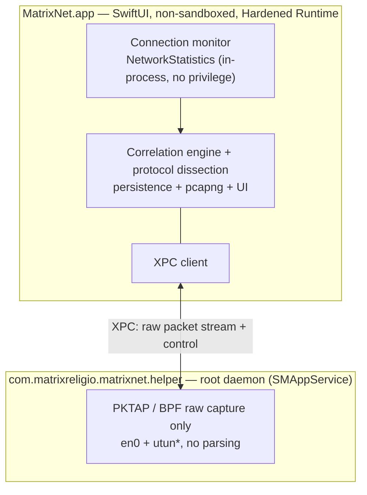

# MatrixNet

[English](./README.md) · [简体中文](./README.zh-CN.md) · [繁體中文](./README.zh-Hant.md) · **日本語** · [한국어](./README.ko.md) · [Français](./README.fr.md) · [Deutsch](./README.de.md) · [Español](./README.es.md)

**どのアプリがどの IP と通信しているかを把握し、任意の通信をパケット単位まで掘り下げる。**

100% ネイティブ SwiftUI で作られた macOS 向けのネットワークモニター兼ディープパケットアナライザー。*誰がネットワーク上にいるか* はアクティビティモニタのように手軽に、*回線上に何が流れているか* は Wireshark のように深く——そしてすべてのパケットが、それを送ったアプリを知っています。

[](https://github.com/MatrixReligio/MatrixNet/actions/workflows/ci.yml)
[](./LICENSE)
[](#動作環境)
[](https://swift.org)
[](https://github.com/MatrixReligio/MatrixNet/releases/latest)
[](https://github.com/MatrixReligio/MatrixNet/releases)
[](https://github.com/MatrixReligio/MatrixNet/stargazers)
[](https://github.com/MatrixReligio/MatrixNet/commits/main)
[](#インストール)
[](#プライバシー)
[](#プライバシー)

> **ステータス：フェーズ 1、開発中。** MatrixNet は活発に開発中の初期段階のプロジェクトです。アーキテクチャは確定し、コアライブラリはテストファーストで構築されていますが、アプリはまだ機能が完成しておらず、安定版リリースはありません。インターフェース・コマンド・UI は変更される可能性があります。

---

## MatrixNet とは？

この 10 年、macOS のネットワークは 2 つのツールが担ってきました。**Little Snitch** は *どのアプリ* がどこへ接続しているかを教えてくれます。**Wireshark** は *回線上のすべてのバイト* を見せてくれますが、どのアプリが生み出したものかは分かりません。MatrixNet はその両方を 1 つのネイティブアプリにまとめます——上層にアプリ別の接続モニタリング、下層にパケットレベルの解析、そして取得した各パケットを、それが属するプロセスと接続に結びつける相関レイヤー。

フェーズ 1 は厳密に **パッシブ——観察するだけで、ブロックはしない** です。ファイアウォールも、トラフィックの傍受も、HTTPS の復号もありません（今後の予定は [ロードマップ](#ロードマップ) を参照）。観察に徹するため、MatrixNet はすでに使っているプロキシ・フィルタ・VPN と衝突せずに共存します。

## 機能

### 🔭 接続モニタリング
- ライブの **概要ダッシュボード**：スループットチャート（直近 1 分）、主要指標（アクティブ接続数、セッション合計、アクティブなアプリ数、到達した国数、脅威接続数、プロキシ経由の割合）、プロトコル構成、宛先国トップ、強化版トップトーカー一覧。
- システム全体・アプリ別のライブ接続一覧：プロセス、リモートホスト/IP、国、上下レート、累積バイト、接続のライフサイクル。
- カーネルが帰属するプロセス所有者——`nettop` やアクティビティモニタと同じ仕組み——なのでポーリング競合なしに正確に帰属します。
- ポートから推定する **クライアント/サーバーの役割**（このホストが発信したのか、接続を受け入れたのか）。
- **プロキシ・VPN/トンネルの認識**——リモートが設定済み/ローカルのプロキシである接続には印が付き、他アプリのトラフィックを中継するプロセス（NetworkExtension トンネル）にはバッジが付くため、経由されているかが一目で分かります。
- **脅威 IP のフラグ付け**——公開された脅威インテリジェンスのブロックリストに載るリモートアドレスに ⚠️ バッジ（助言のみ——MatrixNet はラベル付けするだけでブロックはしません）。
- **TLS SNI と DNS** からホスト名を補強——ClientHello と DNS 応答からアプリが実際に要求したホスト名を**一切復号せずに**読み取り、逆引き DNS の PTR レコード(多くは CDN のワイルドカード)より優先します。ワンクリックで接続ビューとパケットビューの **ドメイン名と生の IP** を切り替え。
- **マップタブ**は実世界のオフライン点描の地球（Natural Earth、地図タイル不使用）を描き、この Mac から通信中の各国へ光る弧を伸ばします——ノードの大きさは接続数、脅威の宛先は赤。
- 後から振り返れる接続履歴（「昨日どのアプリがどこへ接続したか」）。

### 📊 使用量レポート
- 「どこで帯域を使ったのか」に答える新しい**「使用量」タブ**:**今日 / 過去7日 / 過去30日 / 請求サイクル**ごとに、バイト数の多いアプリ・国・ドメインを表示し、ダウンロード/アップロードの推移グラフも備えます。
- ローカルの1時間単位バケットに基づき(既定で90日間保持・設定可能)、再起動しても合計が残ります——ゼロにリセットされるアクティビティモニタとは異なります。
- アプリを選ぶと国・ドメインの内訳をそのアプリだけに絞り込めます。**請求リセット日**を設定すれば「サイクル」期間を契約に合わせられます。

### 🔬 ディープパケット解析
- **すべてのパケットが所有 PID を保持する**パケット単位のキャプチャ。
- 最も重要なプロトコルの堅牢な解析：**Ethernet、IPv4、IPv6、TCP、UDP、ICMP、DNS、TLS（ハンドシェイク / SNI / 証明書）、HTTP/1.1**。
- Wireshark 風の 3 ペイン表示：パケット一覧、プロトコル詳細ツリー、同期した 16 進ビュー。
- ストリーム追跡の再構築と、キャプチャを絞り込む表示フィルタ言語。
- 単一アプリ・単一接続までパケットを絞り込み。
- 選択したパケットやセッション全体を **pcapng** にエクスポート——パケットごとのプロセスメタデータ付きで——Wireshark へ受け渡し。

### 🖥️ デスクトップウィジェット
- WidgetKit ウィジェット（小 / 中 / 大）が、ライブのアクティブ接続数、上下スループット、セッション合計、上位アプリ、脅威ヒット数を、デスクトップや通知センターに表示。

### 🧭 メニューバーとバックグラウンド
- **メニューバー**に常駐し、ライブの ↓/↑ スループットを表示。メインウィンドウを閉じても監視を続けるため、デスクトップウィジェットが古くなりません。
- 任意の **メニューバーのみモード**で Dock アイコンを完全に非表示。
- **ログイン時に起動** と **設定ウィンドウ**（⌘,）でバックグラウンドモード、脅威接続通知、自動アップデート確認、データセットの手動更新を設定。
- **脅威接続通知**——アクティブな接続がフラグ付きアドレスに到達したときに知らせます（助言のみ。MatrixNet はブロックしません）。

### 🌍 あなたの言語で
- **8 言語**に完全ローカライズ——英語、簡体字・繁体字中国語、日本語、韓国語、フランス語、ドイツ語、スペイン語——macOS のシステム言語に自動追従。翻訳カバレッジは CI で強制されています。

### 🔄 常に最新
- [Sparkle](https://sparkle-project.org) による **アプリ内自動アップデート**。EdDSA 署名されたアップデートを GitHub Releases から配信。手動確認も、毎日のバックグラウンド確認も可能。
- **GeoIP データベースは自動更新**——毎月の DB-IP データセットからバックグラウンドで更新され、国の帰属が時間とともに正確に保たれます。
- **脅威 IP リストも同様に自動更新**——公開された IPsum 集約から。アプリは上流フィードではなく、自身のリリースアセットにのみアクセスします。

### 🛡️ プライバシーとゼロコンフリクト
- **設計からしてゼロコンフリクト。** MatrixNet は完全にパッシブで、NetworkExtension を使わず、排他的なルーティング/プロキシ枠を要求せず、パケット経路に座りません。AdGuard、Surge、Little Snitch、LuLu、各種 VPN と共存します。
- **100% ローカル。** すべての処理はあなたのマシン上で行われます。データは端末から出ません。テレメトリなし。アカウント不要。クラウドなし。
- **最小権限。** 接続モニタリングに認可は一切不要。パケットキャプチャは最小限のキャプチャ専用ヘルパーに隔離され、信頼できないバイト列のプロトコル解析は非特権アプリ側で実行されます。

## なぜ MatrixNet？

| | Little Snitch | Wireshark | **MatrixNet（フェーズ 1）** |
|---|:---:|:---:|:---:|
| アプリ別の接続ビュー | ✅ | ❌ | ✅ |
| パケットレベルの解析 | ❌ | ✅ | ✅ |
| すべてのパケットがアプリを知る | ❌ | ❌ | ✅ |
| 接続 ↔ パケットの相関 | ❌ | ❌ | ✅ |
| プロキシ/VPN と共存 | ⚠️ | ✅ | ✅ |
| ネイティブで軽量な macOS アプリ | ✅ | ❌ | ✅ |
| トラフィックのブロック/フィルタ | ✅ | ❌ | ❌（設計上——パッシブ） |

MatrixNet はファイアウォールを置き換えようとはしていません。これは、マシンのネットワーク挙動を——アプリ別の俯瞰からバイト単位まで——システム上の他のものを妨げずに *理解* したいときに手に取るツールです。

## アーキテクチャ

MatrixNet は **パッシブ優先・デュアルソース** の設計（内部的には「アーキテクチャ A′」）に従います。2 つの独立したパッシブソースを 5 タプルと PID で融合します。

- **接続レベル**は Apple の非公開 `NetworkStatistics` フレームワーク（`NStatManager*`）——`nettop` やアクティビティモニタの背後にあるカーネル機構——から得ます。カーネルが各接続を PID に帰属させ、5 タプルとバイトカウンタを報告します。root も entitlement も NetworkExtension も不要で、まさにこれが MatrixNet が何とも衝突しない理由です。
- **パケットレベル**は BPF 上の `PKTAP`（`DLT_PKTAP`）から得て、各パケットに発信元 PID を付与します。VPN が有効なとき、MatrixNet は物理インターフェース（`en0`）とトンネル（`utun*`）の両方をキャプチャします。生キャプチャは root を要するため、`SMAppService` で登録された小さな特権ヘルパーに置かれます。ヘルパーは *キャプチャのみ* を行い、信頼できないネットワークデータのプロトコル解析はすべて非特権のメインアプリで行われます。



**なぜ NetworkExtension を使わないのか？** macOS では、トラフィックをプロセスに帰属させるのに NetworkExtension は *不要* です——カーネルがすでに `NetworkStatistics` で行っています。`NEFilterDataProvider`・`NEPacketTunnelProvider`・`NEDNSProxyProvider` を使うと、ソケット/ルーティング/DNS 経路の排他的で競合する枠を奪い合うことになり、これがフィルタ製品同士の衝突の文書化された原因です。モニタリングツールにとって、パッシブなカーネル観察はゼロコンフリクト要件を完璧に満たします。

完全な設計、モジュール依存グラフ、データフローは [`docs/ARCHITECTURE.md`](./docs/ARCHITECTURE.md) を参照してください。

## 動作環境

- **macOS 26（Tahoe）** 以降
- Apple Silicon または Intel
- ソースからのビルド：**Xcode 26** と [XcodeGen](https://github.com/yonaskolb/XcodeGen)

## インストール

[GitHub Releases](https://github.com/MatrixReligio/MatrixNet/releases) ページから公証済みの `.dmg` をダウンロードし、開いて MatrixNet をアプリケーションフォルダにドラッグします。ビルドは Developer ID で署名され Apple に公証されているため、Gatekeeper は警告なしで開きます。インストール後は MatrixNet が自身を最新に保つので、このページに戻る必要はありません。

MatrixNet は Mac App Store では配布 **されません**：BPF/PKTAP キャプチャと `NetworkStatistics` フレームワークはサンドボックスアプリでは利用できないためです。直接の公証配布は、見落としではなく意図的なアーキテクチャ上の帰結です。

## ソースからのビルド

> 下記の正確なコマンドは仮のもので、ビルド/パッケージスクリプトの整備に伴い **確定予定** です。

```sh
# 1. クローン
git clone https://github.com/MatrixReligio/MatrixNet.git
cd MatrixNet

# 2. 純粋ロジックのコアテストを実行（Xcode 不要）
swift test

# 3. Xcode プロジェクトを生成（アプリ + 特権ヘルパーのターゲット）
xcodegen generate

# 4. アプリをビルド/実行
#    （Xcode 26 で MatrixNet.xcodeproj を開く、または xcodebuild——確定予定）
open MatrixNet.xcodeproj
```

純粋ロジックのコア（ドメインモデル、解析、pcapng、相関など）はローカルの Swift パッケージなので、`swift test` だけでビルド・テストできます。macOS アプリと特権ヘルパーは、`project.yml` から XcodeGen が生成する Xcode ターゲットです。開発フロー全体は [`CONTRIBUTING.md`](./CONTRIBUTING.md) を参照してください。

## 権限

MatrixNet は各レベルで *最小* の権限を求め、優雅に縮退します。

- **接続モニタリング——認可不要。** アプリを起動すれば、どのアプリがネットワーク上にいるかがすぐに見えます。`NetworkStatistics` は root・entitlement・TCC プロンプトなしでインプロセス実行されます。
- **ディープパケットキャプチャ——一度きりのシステム認可。** 生キャプチャには root が必要なため、MatrixNet は `SMAppService` 経由でキャプチャ専用の最小ヘルパーデーモンをインストールし、システム承認が 1 回必要です。拒否やインストール失敗の場合でも、接続モニタリング機能はすべて動作し続け、パケットキャプチャのみが無効になります（再試行プロンプト付き）。

ヘルパーは BPF/PKTAP の root 要件を満たすためだけに存在します。解析は一切行いません——信頼できないネットワークバイトの処理を、意図的に特権プロセスの外に保ちます。

## プライバシー

MatrixNet はすべてをローカルで処理します。あなたのマシンの外へデータを送らず、テレメトリもなく、アカウントも不要で、どのサーバーとも通信しません。キャプチャ・履歴・設定はあなたのディスク上にのみ存在します。

## ロードマップ

フェーズ 1 は意図的にパッシブな監視と解析に範囲を絞っています。後のフェーズで計画中（未実装・保証なし）：

- **ファイアウォール / ブロック**——オプトインの傍受モード（おそらく `NEFilterDataProvider` 経由）。他のソケット層フィルタとの潜在的な衝突について明確な警告付き。
- **AI ネイティブ解析**——自然言語によるトラフィック照会、トラッカー / 異常 / プライバシー漏洩の自動検出。
- **HTTPS 復号（MITM）**——平文検査のためのオプトイン TLS 傍受。
- リモート / モバイルキャプチャ、ルールエンジン、より広範な Wireshark 風プロトコル対応。

## コントリビュート

コントリビュートを歓迎します。MatrixNet はテストファースト、厳格な並行性、SwiftLint/SwiftFormat、Conventional Commits で構築されています。プルリクエストを開く前に [`CONTRIBUTING.md`](./CONTRIBUTING.md) を読み、[行動規範](./CODE_OF_CONDUCT.md) にご留意ください。

セキュリティ問題は非公開で報告してください——[`SECURITY.md`](./SECURITY.md) を参照。

## ライセンス

[Apache License 2.0](./LICENSE) のもとでライセンスされています。Copyright 2026 MatrixReligio LLC. 帰属表示は [`NOTICE`](./NOTICE) を参照。

## 謝辞

MatrixNet は、ネットワークの透明性を当たり前にしたツールたちの肩の上に立っています。数十年にわたるプロトコル解析とキャプチャの仕事に対して **Wireshark** と **tcpdump/libpcap** プロジェクトに、そして macOS におけるアプリ別ネットワーク認識のあるべき姿を示してくれた **Little Snitch** と **LuLu** に感謝します。

同梱データ：国別ジオロケーションは [DB-IP](https://db-ip.com)（CC-BY-4.0）、脅威 IP リストは [IPsum](https://github.com/stamparm/ipsum)（パブリックドメイン）由来、マップタブの世界ジオメトリは [Natural Earth](https://www.naturalearthdata.com)（パブリックドメイン）。完全な帰属表示は [`NOTICE`](./NOTICE) を参照。

---

ご質問・ご意見：[contact@matrixreligio.com](mailto:contact@matrixreligio.com)
