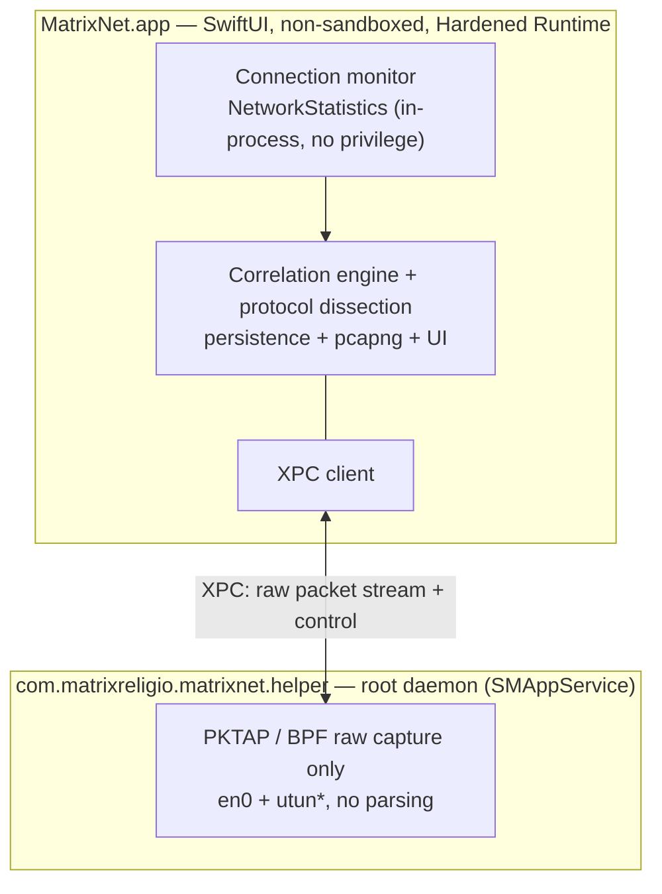

# MatrixNet

[English](./README.md) · [简体中文](./README.zh-CN.md) · [繁體中文](./README.zh-Hant.md) · [日本語](./README.ja.md) · **한국어** · [Français](./README.fr.md) · [Deutsch](./README.de.md) · [Español](./README.es.md)

**어떤 앱이 어떤 IP와 통신하는지 확인하고, 어떤 흐름이든 패킷 단위까지 파고드세요.**

100% 네이티브 SwiftUI로 만든 macOS용 네트워크 모니터 겸 심층 패킷 분석기입니다. *누가 네트워크에 있는지* 는 활성 상태 보기처럼 손쉽게, *회선에 무엇이 흐르는지* 는 Wireshark처럼 깊게 — 그리고 모든 패킷은 자신을 보낸 앱을 알고 있습니다.

[](https://github.com/MatrixReligio/MatrixNet/actions/workflows/ci.yml)
[](./LICENSE)
[](#시스템-요구-사항)
[](https://swift.org)
[](https://github.com/MatrixReligio/MatrixNet/releases/latest)
[](https://github.com/MatrixReligio/MatrixNet/releases)
[](https://github.com/MatrixReligio/MatrixNet/stargazers)
[](https://github.com/MatrixReligio/MatrixNet/commits/main)
[](#설치)
[](#개인정보-보호)
[](#개인정보-보호)

> **상태: 1단계, 개발 진행 중.** MatrixNet은 활발히 개발 중인 초기 단계 프로젝트입니다. 아키텍처는 확정되었고 코어 라이브러리는 테스트 우선으로 구축되고 있지만, 앱은 아직 기능이 완성되지 않았고 안정 릴리스도 없습니다. 인터페이스, 명령, UI는 변경될 수 있습니다.

---

## MatrixNet이란?

지난 10년간 macOS 네트워킹은 두 도구가 지배해 왔습니다. **Little Snitch**는 *어떤 앱* 이 어디로 연결되는지 알려줍니다. **Wireshark**는 *회선의 모든 바이트* 를 보여주지만, 어떤 앱이 만들어냈는지는 알 수 없습니다. MatrixNet은 둘을 하나의 네이티브 앱으로 합칩니다 — 위층에는 앱별 연결 모니터링, 아래층에는 패킷 수준 해부, 그리고 캡처된 각 패킷을 그것이 속한 프로세스와 연결에 묶는 상관 계층.

1단계는 엄격히 **수동적 — 관찰하되 차단하지 않음** 입니다. 방화벽도, 트래픽 가로채기도, HTTPS 복호화도 없습니다(이후 계획은 [로드맵](#로드맵) 참조). 오직 관찰만 하므로, MatrixNet은 이미 사용 중인 프록시·필터·VPN과 다투지 않고 함께 동작합니다.

## 기능

### 🔭 연결 모니터링
- 실시간 **개요 대시보드**: 처리량 차트(최근 1분), 핵심 지표(활성 연결, 세션 합계, 활성 앱, 도달한 국가 수, 위협 연결, 프록시 경유 비율), 프로토콜 구성, 상위 목적지 국가, 강화된 상위 통신 앱 목록.
- 시스템 전체·앱별 실시간 연결 목록: 프로세스, 원격 호스트/IP, 국가, 상하향 속도, 누적 바이트, 연결 수명 주기.
- 커널이 귀속한 프로세스 소유권 — `nettop`과 활성 상태 보기가 쓰는 것과 동일한 메커니즘 — 이라 폴링 경쟁 없이 정확합니다.
- 포트로 추론하는 **클라이언트/서버 역할**(이 호스트가 발신했는지, 연결을 수락했는지).
- **프록시·VPN/터널 인식** — 원격이 설정된/로컬 프록시인 연결에는 표시가, 다른 앱의 트래픽을 중계하는 프로세스(NetworkExtension 터널)에는 배지가 붙어 트래픽 경유 여부가 분명합니다.
- **위협 IP 플래그** — 공개 위협 인텔리전스 차단 목록에 있는 원격 주소에 ⚠️ 배지(권고용 — MatrixNet은 표시만 하고 절대 차단하지 않습니다).
- **새 대상(“phoning home”) 알림** — 선택형·비차단: 알려진 앱이 한 번도 연결한 적 없는 국가에 처음 연결하면 알립니다. 앱별 학습 기간과 속도 제한으로 조용하게 — 차단이나 알림 폭주 없이 아웃바운드 방화벽의 통찰을 제공합니다.
- **TLS SNI와 DNS**로 호스트명 보강 — ClientHello와 DNS 응답에서 앱이 실제로 요청한 호스트명을 **복호화 없이** 읽어, 역방향 DNS의 PTR 레코드(대개 CDN 와일드카드)보다 우선합니다. 원클릭으로 연결·패킷 보기에서 **도메인 이름과 원시 IP**를 전환.
- **지도 탭**은 실제 세계의 오프라인 점묘 지구본(Natural Earth, 지도 타일 미사용)을 그리며, 이 Mac에서 통신 중인 각 국가로 빛나는 호를 뻗습니다 — 노드 크기는 연결 수, 위협 목적지는 빨강.
- 되돌아볼 수 있는 연결 기록("어제 어떤 앱이 어디로 연결했는지").

### 📊 사용량 리포트
- "내 데이터가 어디로 갔는지"에 답하는 새로운 **사용량 탭**: **오늘 / 최근 7일 / 최근 30일 / 청구 주기**별로 바이트 기준 상위 앱·국가·도메인을 보여 주고, 다운로드/업로드 추세 차트도 제공합니다.
- 로컬의 시간 단위 버킷을 기반으로 하며(기본 90일 보관, 설정 가능), 재실행해도 합계가 유지됩니다——0으로 초기화되는 활성 상태 보기와 다릅니다.
- 앱을 선택하면 국가·도메인 분석을 해당 앱으로 한정할 수 있고, **청구 초기화 날짜**를 설정해 "주기" 범위를 요금제에 맞출 수 있습니다.

### 🔬 심층 패킷 분석
- **모든 패킷이 소유 PID를 지니는** 패킷 단위 캡처.
- 가장 중요한 프로토콜의 견고한 해부: **Ethernet, IPv4, IPv6, TCP, UDP, ICMP, DNS, TLS(핸드셰이크 / SNI / 인증서), HTTP/1.1**.
- Wireshark 스타일의 3분할 보기: 패킷 목록, 프로토콜 상세 트리, 동기화된 16진수 보기.
- 스트림 추적 재조립과, 캡처를 잘라보는 표시 필터 언어.
- 단일 앱 또는 단일 연결로 패킷 좁히기.
- 선택한 패킷이나 전체 세션을 **pcapng** 로 내보내기 — 패킷별 프로세스 메타데이터 포함 — Wireshark로 전달.

### 🖥️ 데스크탑 위젯
- WidgetKit 위젯(소 / 중 / 대)이 실시간 활성 연결 수, 상하향 처리량, 세션 합계, 상위 통신 앱, 위협 적중 수를 데스크탑이나 알림 센터에 표시.

### 🧭 메뉴 막대 및 백그라운드
- **메뉴 막대**에 상주하며 실시간 ↓/↑ 처리량을 표시하고, 메인 창을 닫아도 모니터링을 계속해 데스크탑 위젯이 오래되지 않게 합니다.
- 선택적 **메뉴 막대 전용 모드**로 Dock 아이콘을 완전히 숨김.
- **로그인 시 실행** 과 **설정 창**(⌘,)에서 백그라운드 모드, 위협 연결 알림, 자동 업데이트 확인, 데이터셋 수동 새로 고침을 설정.
- **위협 연결 알림** — 활성 연결이 플래그된 주소에 도달하면 알립니다(권고용. MatrixNet은 차단하지 않습니다).

### 🌍 당신의 언어로
- **8개 언어**로 완전 현지화 — 영어, 중국어 간체·번체, 일본어, 한국어, 프랑스어, 독일어, 스페인어 — macOS 시스템 언어를 자동으로 따릅니다. 번역 커버리지는 CI에서 강제됩니다.

### 🔄 항상 최신
- [Sparkle](https://sparkle-project.org)을 통한 **앱 내 자동 업데이트**. EdDSA로 서명된 업데이트를 GitHub Releases에서 제공. 수동 확인 또는 매일 백그라운드 확인 가능.
- **GeoIP 데이터베이스 자동 갱신** — 매월 DB-IP 데이터셋에서 백그라운드로 갱신되어 국가 귀속이 시간이 지나도 정확하게 유지됩니다.
- **위협 IP 목록도 같은 방식으로 자동 갱신** — 공개 IPsum 집계에서. 앱은 상류 피드가 아니라 자체 릴리스 자산에만 연결합니다.

### 🛡️ 개인정보 보호 및 무충돌
- **설계상 무충돌.** MatrixNet은 완전히 수동적입니다. NetworkExtension을 쓰지 않고, 배타적 라우팅/프록시 슬롯을 요구하지 않으며, 패킷 경로에 끼어들지 않습니다. AdGuard, Surge, Little Snitch, LuLu, 모든 VPN과 공존합니다.
- **100% 로컬.** 모든 처리는 당신의 기기에서 이뤄집니다. 데이터는 기기를 떠나지 않습니다. 텔레메트리 없음. 계정 없음. 클라우드 없음.
- **최소 권한.** 연결 모니터링은 어떤 인가도 필요 없습니다. 패킷 캡처는 최소한의 캡처 전용 헬퍼에 격리되고, 신뢰할 수 없는 바이트의 프로토콜 파싱은 비특권 앱에서 실행됩니다.

## 왜 MatrixNet인가?

| | Little Snitch | Wireshark | **MatrixNet(1단계)** |
|---|:---:|:---:|:---:|
| 앱별 연결 보기 | ✅ | ❌ | ✅ |
| 패킷 수준 해부 | ❌ | ✅ | ✅ |
| 모든 패킷이 앱을 앎 | ❌ | ❌ | ✅ |
| 연결 ↔ 패킷 상관 | ❌ | ❌ | ✅ |
| 프록시/VPN과 공존 | ⚠️ | ✅ | ✅ |
| 네이티브·경량 macOS 앱 | ✅ | ❌ | ✅ |
| 트래픽 차단/필터 | ✅ | ❌ | ❌(설계상 — 수동적) |

MatrixNet은 방화벽을 대체하려는 것이 아닙니다. 시스템에서 실행 중인 다른 것을 방해하지 않으면서, 앱별 조감도부터 바이트 단위까지 기기의 네트워크 동작을 *이해* 하고 싶을 때 손에 잡는 도구입니다.

## 아키텍처

MatrixNet은 **수동 우선·이중 소스** 설계(내부적으로 "아키텍처 A′")를 따릅니다. 두 개의 독립적인 수동 소스를 5-튜플과 PID로 융합합니다.

- **연결 수준** 은 Apple의 비공개 `NetworkStatistics` 프레임워크(`NStatManager*`) — `nettop`과 활성 상태 보기 뒤의 커널 메커니즘 — 에서 옵니다. 커널이 각 연결을 PID에 귀속시키고 5-튜플과 바이트 카운터를 보고합니다. root도, entitlement도, NetworkExtension도 필요 없으며, 이것이 바로 MatrixNet이 무엇과도 충돌하지 않는 이유입니다.
- **패킷 수준** 은 BPF 위의 `PKTAP`(`DLT_PKTAP`)에서 오며 각 패킷에 발신 PID를 태깅합니다. VPN이 활성일 때 MatrixNet은 물리 인터페이스(`en0`)와 터널(`utun*`)을 모두 캡처합니다. 원시 캡처는 root가 필요하므로 `SMAppService`로 등록된 작은 특권 헬퍼에 있습니다. 헬퍼는 *캡처만* 하며, 신뢰할 수 없는 네트워크 데이터의 모든 프로토콜 해부는 비특권 메인 앱에서 일어납니다.



**왜 NetworkExtension을 쓰지 않는가?** macOS에서 트래픽을 프로세스에 귀속시키는 데 NetworkExtension은 *필요하지 않습니다* — 커널이 이미 `NetworkStatistics`로 하고 있습니다. `NEFilterDataProvider`·`NEPacketTunnelProvider`·`NEDNSProxyProvider`를 쓰면 소켓/라우팅/DNS 경로의 배타적이고 경합하는 슬롯을 두고 다투게 되며, 이것이 필터링 제품 간 충돌의 문서화된 원인입니다. 모니터링 도구에는 수동적 커널 관찰이 무충돌 요건을 완벽히 충족합니다.

전체 설계, 모듈 의존성 그래프, 데이터 흐름은 [`docs/ARCHITECTURE.md`](./docs/ARCHITECTURE.md)를 참조하세요.

## 시스템 요구 사항

- **macOS 26 (Tahoe)** 이상
- Apple Silicon 또는 Intel
- 소스 빌드: **Xcode 26** 및 [XcodeGen](https://github.com/yonaskolb/XcodeGen)

## 설치

[GitHub Releases](https://github.com/MatrixReligio/MatrixNet/releases) 페이지에서 공증된 `.dmg`를 내려받아 열고 MatrixNet을 응용 프로그램 폴더로 드래그하세요. 빌드는 Developer ID로 서명되고 Apple에 의해 공증되어 Gatekeeper가 경고 없이 엽니다. 설치 후 MatrixNet이 스스로 최신을 유지하므로 이 페이지를 다시 찾을 필요가 없습니다.

MatrixNet은 Mac App Store로 배포되지 **않습니다**: BPF/PKTAP 캡처와 `NetworkStatistics` 프레임워크는 샌드박스 앱에서 사용할 수 없기 때문입니다. 직접 공증 배포는 실수가 아니라 의도된 아키텍처적 귀결입니다.

## 소스에서 빌드

> 아래 명령은 자리표시자이며 빌드/패키징 스크립트가 정착되면 **확정될 예정** 입니다.

```sh
# 1. 클론
git clone https://github.com/MatrixReligio/MatrixNet.git
cd MatrixNet

# 2. 순수 로직 코어 테스트 실행(Xcode 불필요)
swift test

# 3. Xcode 프로젝트 생성(앱 + 특권 헬퍼 타깃)
xcodegen generate

# 4. 앱 빌드/실행
#    (Xcode 26에서 MatrixNet.xcodeproj 열기, 또는 xcodebuild — 확정 예정)
open MatrixNet.xcodeproj
```

순수 로직 코어(도메인 모델, 해부, pcapng, 상관 등)는 로컬 Swift 패키지라 `swift test`만으로 빌드·테스트됩니다. macOS 앱과 특권 헬퍼는 `project.yml`에서 XcodeGen이 생성하는 Xcode 타깃입니다. 전체 개발 흐름은 [`CONTRIBUTING.md`](./CONTRIBUTING.md)를 참조하세요.

## 권한

MatrixNet은 각 수준에서 *최소* 권한을 요청하고 우아하게 축소됩니다.

- **연결 모니터링 — 인가 불필요.** 앱을 실행하면 어떤 앱이 네트워크에 있는지 즉시 보입니다. `NetworkStatistics`는 root·entitlement·TCC 프롬프트 없이 인프로세스로 실행됩니다.
- **심층 패킷 캡처 — 일회성 시스템 인가.** 원시 캡처에는 root가 필요하므로 MatrixNet은 `SMAppService`를 통해 캡처 전용 최소 헬퍼 데몬을 설치하며, 한 번의 시스템 승인이 필요합니다. 거부하거나 설치가 실패해도 모든 연결 모니터링 기능은 계속 작동하고 패킷 캡처만 비활성화됩니다(재시도 프롬프트 포함).

헬퍼는 오직 BPF/PKTAP의 root 요건을 충족하기 위해 존재합니다. 파싱은 전혀 하지 않습니다 — 신뢰할 수 없는 네트워크 바이트 처리를 의도적으로 특권 프로세스 밖에 둡니다.

## 개인정보 보호

MatrixNet은 모든 것을 로컬에서 처리합니다. 기기 밖으로 데이터를 보내지 않고, 텔레메트리가 없으며, 계정이 필요 없고, 어떤 서버와도 통신하지 않습니다. 캡처, 기록, 설정은 오직 당신의 디스크에만 존재합니다.

## 로드맵

1단계는 의도적으로 수동 모니터링과 분석으로 범위를 한정했습니다. 이후 단계로 계획됨(미구현·보장 없음):

- **방화벽 / 차단** — 옵트인 가로채기 모드(아마 `NEFilterDataProvider` 경유). 다른 소켓 계층 필터와의 잠재적 충돌에 대한 명확한 경고 포함.
- **AI 네이티브 분석** — 트래픽에 대한 자연어 질의, 추적기 / 이상 / 개인정보 유출 자동 탐지.
- **HTTPS 복호화(MITM)** — 평문 검사를 위한 옵트인 TLS 가로채기.
- 원격 / 모바일 캡처, 규칙 엔진, 더 넓은 Wireshark 스타일 프로토콜 지원.

## 기여

기여를 환영합니다. MatrixNet은 테스트 우선, 엄격한 동시성, SwiftLint/SwiftFormat, Conventional Commits로 구축됩니다. 풀 리퀘스트를 열기 전에 [`CONTRIBUTING.md`](./CONTRIBUTING.md)를 읽고 [행동 강령](./CODE_OF_CONDUCT.md)에 유의하세요.

보안 문제는 비공개로 보고해 주세요 — [`SECURITY.md`](./SECURITY.md) 참조.

## 라이선스

[Apache License 2.0](./LICENSE) 하에 라이선스됩니다. Copyright 2026 MatrixReligio LLC. 귀속 표시는 [`NOTICE`](./NOTICE) 참조.

## 감사의 말

MatrixNet은 네트워크 투명성을 표준으로 만든 도구들의 어깨 위에 서 있습니다. 수십 년에 걸친 프로토콜 해부와 캡처 작업에 대해 **Wireshark** 와 **tcpdump/libpcap** 프로젝트에, 그리고 macOS에서 앱별 네트워크 인식이 어떤 모습일 수 있는지 보여준 **Little Snitch** 와 **LuLu** 에 감사드립니다.

번들 데이터: 국가 지오로케이션은 [DB-IP](https://db-ip.com)(CC-BY-4.0), 위협 IP 목록은 [IPsum](https://github.com/stamparm/ipsum)(퍼블릭 도메인) 기반, 지도 탭의 세계 지오메트리는 [Natural Earth](https://www.naturalearthdata.com)(퍼블릭 도메인). 전체 귀속 표시는 [`NOTICE`](./NOTICE) 참조.

---

질문이나 의견: [contact@matrixreligio.com](mailto:contact@matrixreligio.com)
