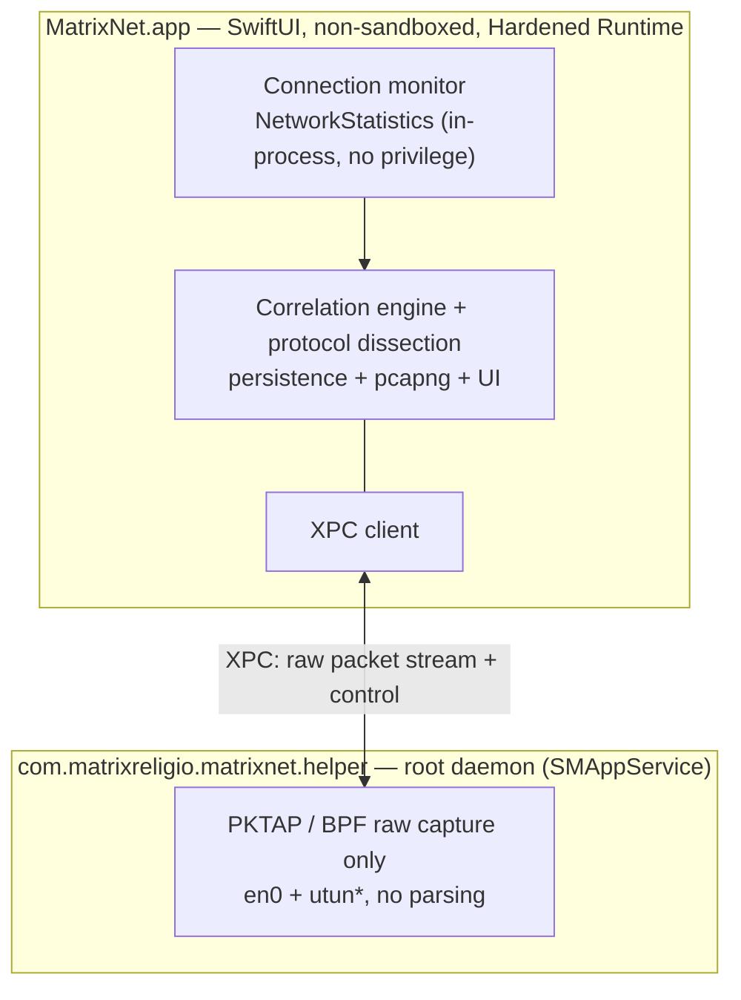

# MatrixNet

**English** · [简体中文](./README.zh-CN.md) · [繁體中文](./README.zh-Hant.md) · [日本語](./README.ja.md) · [한국어](./README.ko.md) · [Français](./README.fr.md) · [Deutsch](./README.de.md) · [Español](./README.es.md)

**See which app is talking to which IP — then dig any flow down to the packet.**

A 100% native SwiftUI network monitor and deep packet analyzer for macOS. As
effortless as Activity Monitor for *who is on the network*, as deep as Wireshark
for *what is on the wire* — and every packet knows which app sent it.

[](https://github.com/MatrixReligio/MatrixNet/actions/workflows/ci.yml)
[](./LICENSE)
[](#requirements)
[](https://swift.org)
[](https://github.com/MatrixReligio/MatrixNet/releases/latest)
[](https://github.com/MatrixReligio/MatrixNet/releases)
[](https://github.com/MatrixReligio/MatrixNet/stargazers)
[](https://github.com/MatrixReligio/MatrixNet/commits/main)
[](#installation)
[](#privacy)
[](#privacy)

> **100% passive — observe, never block.** MatrixNet reads only from the kernel's
> statistics and a copy of each packet, so it runs alongside any proxy, filter, or
> VPN without conflict. No firewall, no traffic interception, no HTTPS decryption.

---

## What is MatrixNet?

Two tools have owned macOS networking for a decade. **Little Snitch** tells you
*which app* is connecting where. **Wireshark** shows you *every byte on the wire*
— but with no idea which app produced it. MatrixNet brings both into one native
app: per-app connection monitoring on top, packet-level dissection underneath,
and a correlation layer that ties every captured packet back to the process and
connection it belongs to.

MatrixNet is strictly **passive — observe, never block**. There is no firewall,
no traffic interception, and no HTTPS decryption. Because it only observes,
MatrixNet runs alongside whatever proxy, filter, or VPN you already use without
fighting it.

## Features

### 🔭 Connection Monitoring
- A live **Overview dashboard**: a throughput chart (last minute), headline
  metrics (active connections, session total, active apps, countries reached,
  threat connections, share via proxy), a protocol-mix breakdown, top
  destination countries, and an enriched Top Talkers list.
- System-wide, per-app live connection list: process, remote host/IP, country,
  up/down rate, cumulative bytes, and connection lifecycle. The Connections,
  History and Usage views **group by app by default** — click an app to drill
  into its individual flows.
- Kernel-attributed process ownership — the same mechanism `nettop` and Activity
  Monitor use — so attribution is accurate without polling races.
- **Client/server role** inferred per flow from the ports (did this host dial
  out, or accept a connection?).
- **Proxy & VPN/tunnel awareness** — connections whose remote is your configured
  or local proxy are marked, and processes that relay other apps' traffic
  (NetworkExtension tunnels) are badged, so it's clear when traffic is routed.
  With packet capture on, a proxied connection still shows its **real domain and
  byte volume** (read from the tunnel interface), and the "via proxy" metric is a
  share of bytes.
- **Threat-IP flagging** — remote addresses on a public threat-intelligence
  blocklist are flagged with a ⚠️ badge (advisory only — MatrixNet labels, it
  never blocks).
- **New-destination ("phoning home") alerts** — opt-in, non-blocking
  notifications when a known app first reaches a country it has never reached
  before. A per-app learning window and rate-limiting keep it quiet; it's the
  insight of an outbound firewall without the blocking or the alert-flood.
- Hostname enrichment from **TLS SNI and DNS** — the exact host an app requested,
  read straight from the ClientHello and DNS answers **without any decryption**,
  and preferred over reverse-DNS PTR records (which are often CDN wildcards). A
  one-click toggle shows **domain names or raw IPs** across the Connections and
  Packets views.
- A **Map tab** plots a real-world, offline dotted globe (Natural Earth, no map
  tiles) with glowing arcs from this Mac to every country it is talking to —
  node size by connection count, threat destinations in red.
- Connection history you can look back through ("which app connected where
  yesterday").

### 📊 Usage Reports
- A **Usage tab** that answers "where did my bandwidth go": the top apps,
  countries, and domains by bytes over **Today / 7 days / 30 days / your billing
  cycle**, with a download/upload trend chart.
- Built from hourly buckets kept locally (default 90 days, configurable), so
  totals survive relaunch — unlike Activity Monitor, which resets to zero.
- Select an app to scope the country and domain breakdowns to just that app, and
  set a **billing-cycle reset day** so the "Cycle" window matches your plan.
- **Export** the current period as CSV or JSON for reporting, billing, or audit.

### 🔬 Deep Packet Analysis
- Per-packet capture where **every packet carries its owning PID**.
- Solid dissection of the protocols that matter most: **Ethernet, IPv4, IPv6,
  TCP, UDP, ICMP, DNS, TLS (handshake / SNI / certificate), and HTTP/1.1**.
- **JA4 TLS client fingerprinting, per app** — passively derive each app's TLS
  stack from the ClientHello (a browser engine vs Go vs curl vs a suspicious
  library) without any decryption; shown on the TLS layer and per app in the
  connection inspector, with recognized stacks labelled.
- **HTTP/3 / QUIC visibility** — passively decrypt the QUIC Initial (public,
  DCID-derived keys per RFC 9001 — no secret, no MITM) to read each HTTP/3
  connection's SNI, ALPN, and version, and compute its QUIC JA4, all per app.
- **Per-app network quality** — passively measure each TCP connection's handshake
  RTT, retransmits, and connection-setup time from the captured packets, shown in
  the connection inspector (capture-only; no probes sent).
- **Per-app encrypted DNS** — see which apps still use plaintext DNS vs DoT, DoQ,
  or DoH (with the resolver named), classified from the 5-tuple and hostname — no
  packet capture required.
- **Per-app activity timeline** — a heat strip per app showing when it was active
  (by hour or day) from persisted usage, so background/overnight activity stands out.
- A Wireshark-style three-pane view: packet list, protocol detail tree, and
  synchronized hex.
- Follow Stream reassembly and a display-filter language to slice the capture.
- Filter packets down to a single app or a single connection.
- Export selected packets or whole sessions to **pcapng** — including per-packet
  process metadata — to hand off to Wireshark.

### 🖥️ Desktop Widget
- A WidgetKit widget (small / medium / large) shows live active-connection count,
  up/down throughput, session totals, the top talking apps, and a threat-hit
  count — right on your desktop or in Notification Center.

### 🧭 Menu Bar & Background
- Lives in the **menu bar** with a live ↓/↑ throughput readout, and keeps
  monitoring after you close the main window — so the desktop widget never goes
  stale.
- Optional **menu-bar-only mode** hides the Dock icon entirely.
- **Launch at login** and a **Settings window** (⌘,) for background mode,
  threat-connection notifications, automatic update checks, and on-demand dataset
  refresh.
- **Threat-connection notifications** alert you when an active connection reaches
  a flagged address — advisory only; MatrixNet never blocks.

### 🌍 Speaks Your Language
- Fully localized into **8 languages** — English, Simplified & Traditional
  Chinese, Japanese, Korean, French, German, and Spanish — following your macOS
  system language automatically. Translation coverage is enforced in CI.

### 🔄 Stays Current
- **In-app auto-update** via [Sparkle](https://sparkle-project.org), with EdDSA-
  signed updates served from GitHub Releases. Check on demand or let it check
  daily in the background.
- The **GeoIP database refreshes automatically** in the background from the
  monthly DB-IP dataset, so country attribution stays accurate over time. It
  covers both **IPv4 and IPv6** destinations, so the map and country metrics
  don't under-count IPv6 traffic. When a local proxy/tunnel is active the
  destination IP is a synthetic placeholder, so the country is recovered from the
  real domain instead (see Privacy).
- The **threat-IP list refreshes automatically** the same way, from the public
  IPsum aggregate — the app only ever contacts its own release asset, never the
  upstream feeds.

### 🛡️ Privacy & Zero-Conflict
- **Zero conflict by design.** MatrixNet is fully passive: it uses no
  NetworkExtension, claims no exclusive routing/proxy slot, and never sits in the
  packet path. It coexists with AdGuard, Surge, Little Snitch, LuLu, and any VPN.
- **100% local, passive capture.** All packet and connection processing happens
  on your machine — no telemetry, no account, no cloud. The one network request
  MatrixNet can make for monitoring is the optional GeoIP country lookup for
  *proxied* flows (on by default): when a local proxy hides the real address, it
  resolves the destination's domain over encrypted DNS (DoH) to recover its
  country. Turn it off in Settings to keep no data leaving the device.
- **Least privilege.** Connection monitoring needs no authorization at all.
  Packet capture is isolated in a minimal, capture-only helper; protocol parsing
  of untrusted bytes runs in the unprivileged app.

## Why MatrixNet?

| | Little Snitch | Wireshark | **MatrixNet** |
|---|:---:|:---:|:---:|
| Per-app connection view | ✅ | ❌ | ✅ |
| Packet-level dissection | ❌ | ✅ | ✅ |
| Every packet knows its app | ❌ | ❌ | ✅ |
| Connection ↔ packet correlation | ❌ | ❌ | ✅ |
| Coexists with proxies/VPNs | ⚠️ | ✅ | ✅ |
| Native, lightweight macOS app | ✅ | ❌ | ✅ |
| Blocks/filters traffic | ✅ | ❌ | ❌ (by design — passive) |

MatrixNet is not trying to replace a firewall. It is the tool you reach for when
you want to *understand* your machine's network behavior — from a bird's-eye,
per-app overview all the way down to the bytes — without disrupting anything else
running on the system.

## Architecture

MatrixNet follows a **passive-first, dual-source** design (internally referred to
as "Architecture A′"). Two independent passive sources are fused by 5-tuple and
PID:

- **Connection level** comes from Apple's private `NetworkStatistics` framework
  (`NStatManager*`) — the kernel mechanism behind `nettop` and Activity Monitor.
  The kernel attributes each connection to a PID and reports the 5-tuple and byte
  counters. This needs no root, no entitlement, and no NetworkExtension, which is
  exactly why MatrixNet conflicts with nothing.
- **Packet level** comes from `PKTAP` (`DLT_PKTAP`) over BPF, which tags each
  packet with its originating PID. When a VPN is active, MatrixNet captures both
  the physical interface (`en0`) and the tunnel(s) (`utun*`). Raw capture
  requires root, so it lives in a small privileged helper registered via
  `SMAppService`. The helper *only captures* — all protocol dissection of
  untrusted network data happens back in the unprivileged main app.



**Why no NetworkExtension?** On macOS, attributing traffic to a process does
*not* require NetworkExtension — the kernel already does it via
`NetworkStatistics`. Using `NEFilterDataProvider`, `NEPacketTunnelProvider`, or
`NEDNSProxyProvider` would mean competing for exclusive, contended slots in the
socket/routing/DNS path, which is the documented source of conflicts between
filtering products. For a monitoring tool, passive kernel observation satisfies
the zero-conflict requirement perfectly.

See [`docs/ARCHITECTURE.md`](./docs/ARCHITECTURE.md) for the full design,
module dependency graph, and data flows.

## Requirements

- **macOS 26 (Tahoe)** or later
- Apple Silicon or Intel
- For building from source: **Xcode 26** and [XcodeGen](https://github.com/yonaskolb/XcodeGen)

## Installation

Download the notarized `.dmg` from the
[GitHub Releases](https://github.com/MatrixReligio/MatrixNet/releases) page, open
it, and drag MatrixNet to your Applications folder. Builds are signed with a
Developer ID and notarized by Apple, so Gatekeeper opens them without warnings.
Once installed, MatrixNet keeps itself up to date — no need to revisit this page.

MatrixNet is **not** distributed through the Mac App Store: BPF/PKTAP capture and
the `NetworkStatistics` framework are not available to sandboxed apps. Direct,
notarized distribution is a deliberate architectural consequence, not an
oversight.

## Building from Source

> The exact commands below are placeholders and **to be finalized** as the build
> and packaging scripts land.

```sh
# 1. Clone
git clone https://github.com/MatrixReligio/MatrixNet.git
cd MatrixNet

# 2. Run the pure-logic core test suite (no Xcode required)
swift test

# 3. Generate the Xcode project (App + privileged helper targets)
xcodegen generate

# 4. Build / run the app
#    (open MatrixNet.xcodeproj in Xcode 26, or use xcodebuild — to be finalized)
open MatrixNet.xcodeproj
```

The pure-logic core (domain model, dissection, pcapng, correlation, etc.) is a
local Swift Package, so it builds and tests with plain `swift test`. The macOS
app and the privileged helper are Xcode targets generated by XcodeGen from
`project.yml`. See [`CONTRIBUTING.md`](./CONTRIBUTING.md) for the full developer
workflow.

## Permissions

MatrixNet asks for the *least* privilege at each level, and degrades gracefully:

- **Connection monitoring — no authorization required.** Launch the app and you
  immediately see which apps are on the network. `NetworkStatistics` runs
  in-process with no root, entitlement, or TCC prompt.
- **Deep packet capture — one-time system authorization.** Raw capture needs
  root, so MatrixNet installs a minimal capture-only helper daemon via
  `SMAppService`, which requires a single system approval. If you decline or the
  install fails, every connection-monitoring feature keeps working and only
  packet capture is disabled (with a retry prompt).

The helper exists solely to satisfy the root requirement of BPF/PKTAP. It does
no parsing — handling untrusted network bytes stays out of the privileged
process on purpose.

## Privacy

MatrixNet processes everything locally — no telemetry, no account, no cloud. The
only network request it can make for monitoring is the optional GeoIP country
lookup for proxied flows (on by default): when a local proxy hides the real
address, it resolves the destination's domain over encrypted DNS (DoH) to recover
its country. Turn it off in Settings to keep no data leaving your machine.
Captures, history, and settings live only on your disk.

## Versioning

MatrixNet follows [Semantic Versioning](https://semver.org): **MAJOR.MINOR.PATCH**.

- **MAJOR** — incompatible changes or a fundamental shift in what the app does.
- **MINOR** — new, backward-compatible features.
- **PATCH** — backward-compatible bug fixes.

Every release is notarized and delivered through the in-app updater. See the
[CHANGELOG](./CHANGELOG.md) for what changed in each version.

## Contributing

Contributions are welcome. MatrixNet is built test-first with strict
concurrency, SwiftLint/SwiftFormat, and Conventional Commits. Please read
[`CONTRIBUTING.md`](./CONTRIBUTING.md) before opening a pull request, and note
our [Code of Conduct](./CODE_OF_CONDUCT.md).

Security issues should be reported privately — see [`SECURITY.md`](./SECURITY.md).

## License

Licensed under the [Apache License 2.0](./LICENSE). Copyright 2026 MatrixReligio
LLC. See [`NOTICE`](./NOTICE) for attributions.

## Acknowledgements

MatrixNet stands on the shoulders of the tools that made network transparency a
norm. Thanks to the **Wireshark** and **tcpdump/libpcap** projects for decades of
protocol dissection and capture work, and to **Little Snitch** and **LuLu** for
showing what per-app network awareness on macOS can be.

Bundled data: country geolocation by [DB-IP](https://db-ip.com) (CC-BY-4.0), the
threat-IP list derived from [IPsum](https://github.com/stamparm/ipsum) (public
domain), and the Map tab's world geometry from
[Natural Earth](https://www.naturalearthdata.com) (public domain). See
[`NOTICE`](./NOTICE) for full attributions.

---

Questions or feedback: [contact@matrixreligio.com](mailto:contact@matrixreligio.com)
