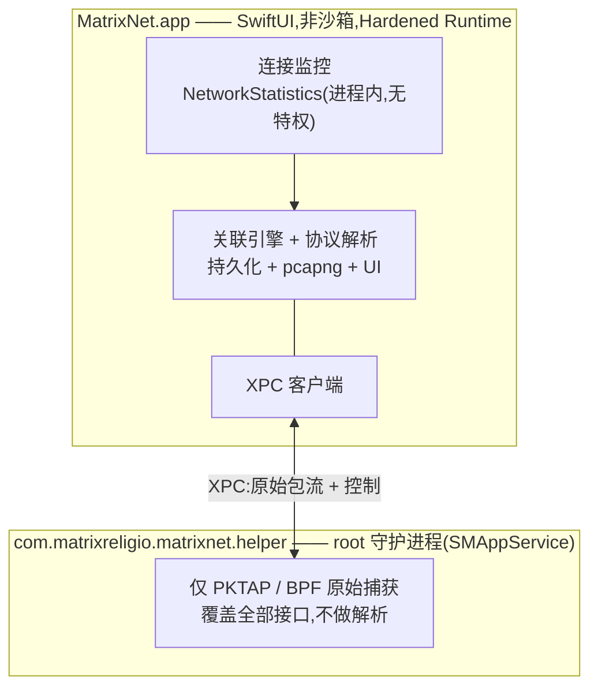

# MatrixNet

[English](./README.md) · **简体中文** · [繁體中文](./README.zh-Hant.md) · [日本語](./README.ja.md) · [한국어](./README.ko.md) · [Français](./README.fr.md) · [Deutsch](./README.de.md) · [Español](./README.es.md)

**看清每个 App 正在和哪个 IP 通信 —— 再把任意一条流追到数据包级别。**

一款 100% 原生 SwiftUI 的 macOS 网络监控与深度数据包分析工具。看「谁在上网」像活动监视器一样轻松,看「网线上跑的是什么」像 Wireshark 一样深入 —— 而且每个数据包都知道是哪个 App 发出的。

<a href="https://www.producthunt.com/posts/matrixnet" target="_blank"><picture><source media="(prefers-color-scheme: dark)" srcset="https://api.producthunt.com/widgets/embed-image/v1/featured.svg?post_id=1183718&theme=dark" /></picture></a>

[](https://github.com/MatrixReligio/MatrixNet/actions/workflows/ci.yml)
[](./LICENSE)
[](#系统要求)
[](https://swift.org)
[](https://github.com/MatrixReligio/MatrixNet/releases/latest)
[](https://github.com/MatrixReligio/MatrixNet/releases)
[](https://github.com/MatrixReligio/MatrixNet/stargazers)
[](https://github.com/MatrixReligio/MatrixNet/commits/main)
[](#安装)
[](#隐私)
[](#隐私)

> **100% 被动 —— 只观察,绝不拦截。** MatrixNet 只读取内核统计与每个数据包的副本,因而能与任何代理、过滤器或 VPN 并存而不冲突。没有防火墙、不截流量、不解密 HTTPS。

---

## MatrixNet 是什么?

十年来,macOS 网络领域由两类工具主导。**Little Snitch** 告诉你「哪个 App」在连向何处;**Wireshark** 让你看到「网线上的每一个字节」—— 却不知道是哪个 App 产生的。MatrixNet 把两者合二为一:上层是按 App 的连接监控,底层是数据包级别的协议解析,中间有一层关联引擎,把每个捕获到的数据包追溯回它所属的进程与连接。

MatrixNet 严格保持**被动 —— 只观察,绝不拦截**。没有防火墙,不截流量,也不解密 HTTPS。正因为只观察,MatrixNet 能与你已在使用的任何代理、过滤器或 VPN 并存,互不干扰。

## 功能

### 🔭 连接监控
- 实时**概览仪表盘**:吞吐曲线(近一分钟)、关键指标(活动连接、会话总量、活动应用、触达国家、威胁连接、经代理占比)、协议构成、目的地国家排行,以及增强版流量排行。
- 全系统、按 App 的实时连接列表:进程、远端主机/IP、国家/地区、上下行速率、累计字节与连接生命周期。 连接、历史与用量视图默认按应用聚合——点击某个应用即可下钻查看其逐条连接。
- 由内核归因进程归属 —— 与 `nettop` 和活动监视器同源的机制 —— 归因准确,无轮询竞争。
- 由端口推断的**客户端/服务端角色**(本机是发起连接,还是接受连接?)。
- **代理与 VPN/隧道识别** —— 远端为你配置的或本地代理的连接会被标记,而为其他 App 中继流量的进程(NetworkExtension 隧道)会打上徽章,让流量是否被转发一目了然。 开启包捕获时,经代理的连接仍会显示真实域名与流量(从隧道接口读取),“通过代理”指标按字节计。
- **威胁 IP 标记** —— 位于公开威胁情报封禁列表上的远端地址会以 ⚠️ 徽章标出(仅供参考 —— MatrixNet 只标记,绝不拦截)。
- **新目的地(“phoning home”)提醒** —— 可选、非阻断:当某个已知应用首次连到从未去过的国家／地区时通知你。每个应用有学习窗 + 限流,保持安静——这是出站防火墙的洞察,但不拦截、不刷屏。
- 从 **TLS SNI 与 DNS** 富集主机名——直接从 ClientHello 与 DNS 应答读取 App 真正请求的主机名,**全程不解密**,且优先于反向 DNS 的 PTR 记录(后者常是 CDN 泛域名)。一键开关可在连接与数据包视图中显示**域名或原始 IP**。
- **地图标签页**绘制真实世界的离线点阵地球(Natural Earth,不拉地图瓦片),从本机向每个正在通信的国家拉出发光弧线 —— 节点大小按连接数,威胁目的地为红色。
- 连接历史可回溯(「昨天哪个 App 连到了哪里」)。

### 📊 用量报表
- 全新**「用量」标签页**,回答"我的流量去哪了":按字节统计 **今天 / 近 7 天 / 近 30 天 / 本计费周期** 的 Top 应用、国家与域名,并配下载/上传趋势图。
- 基于本地按小时聚合的桶(默认保留 90 天,可配置),总量在重启后依然保留——不像活动监视器会清零。
- 选中某个应用即可把国家与域名分解限定到该应用;可设置**计费重置日**,让"周期"窗口与你的套餐一致。
- 可将当前时间段**导出**为 CSV 或 JSON,用于报表、对账或审计。

### 🔬 深度数据包分析
- 逐包捕获,**每个数据包都携带其归属 PID**。
- 扎实解析最关键的协议:**Ethernet、IPv4、IPv6、TCP、UDP、ICMP、DNS、TLS(握手 / SNI / 证书)与 HTTP/1.1**。
- **JA4 TLS 客户端指纹(按应用)** —— 不解密,从 ClientHello 被动推断每个 App 的 TLS 栈(浏览器内核 / Go / curl / 可疑库);显示在 TLS 层与连接检查器,已识别的栈会标注。
- **HTTP/3 / QUIC 可见性** —— 被动解密 QUIC Initial(RFC 9001 的公开 DCID 派生密钥,无需机密、不中间人)读出每条 HTTP/3 连接的 SNI、ALPN、版本,并算出 QUIC JA4,全部按应用归属。
- **按应用网络质量** —— 被动测量每条 TCP 连接的握手 RTT、重传与连接建立时长,显示在连接检查器(仅抓包时、不发送探测包)。
- **按应用加密 DNS** —— 从 5 元组与主机名判定每个应用用的是明文 DNS 还是 DoT/DoQ/DoH(并标出解析器),无需抓包。
- **按应用活动时间线** —— 从已存储用量为每个应用绘制一条活动热力条(按小时或天),后台/夜间活动一目了然。
- Wireshark 风格的三栏视图:包列表、协议详情树,以及同步的十六进制视图。
- Follow Stream 流重组,以及切分捕获的显示过滤语言。
- 可将数据包过滤到单个 App 或单条连接。
- 将选中数据包或整个会话导出为 **pcapng** —— 含逐包进程元数据 —— 交给 Wireshark。

### 🖥️ 桌面 Widget
- WidgetKit 小组件(小 / 中 / 大尺寸)在桌面或通知中心显示活动连接数、上下行吞吐、会话累计流量、流量最高的 App,以及威胁命中数。
- 当 App 窗口在前台时实时更新;在后台,macOS 将第三方小组件的刷新限制为大约每 30 分钟一次(WidgetKit 每日配额)。要看精确到秒的速率,请看菜单栏。

### 🧭 菜单栏与后台
- 常驻**菜单栏**,实时显示 ↓/↑ 吞吐,并在你关闭主窗口后持续监控 —— 因此小组件读取的共享数据即使在 App 处于后台时也保持最新。
- 可选的**仅菜单栏模式**会完全隐藏 Dock 图标。
- **开机时启动** 与 **设置窗口**(⌘,),可设置后台模式、威胁连接通知、自动检查更新,以及按需刷新数据集。
- **威胁连接通知** —— 当活动连接触及被标记的地址时提醒你(仅供参考;MatrixNet 绝不拦截)。

### 🌍 支持你的语言
- 完整本地化为 **8 种语言** —— 英语、简体中文、繁体中文、日语、韩语、法语、德语、西班牙语 —— 自动跟随你的 macOS 系统语言。翻译完整性由 CI 强制校验。

### 🔄 保持最新
- 通过 [Sparkle](https://sparkle-project.org) 实现**应用内自动更新**,更新包以 EdDSA 签名并由 GitHub Releases 分发。可手动检查,也可后台每日自动检查。
- **GeoIP 数据库自动后台更新**,数据源为按月发布的 DB-IP 数据集,使国家/地区归因长期保持准确。它同时覆盖 **IPv4 与 IPv6** 目标地址,因此地图与国家/地区指标不会少计 IPv6 流量。 本地代理/隧道激活时,目的地 IP 是合成占位地址,因此国家会改用真实域名解析得出(见隐私)。
- **威胁 IP 列表也以相同方式自动更新**,来自公开的 IPsum 汇总 —— App 只会访问自己的发布资源,绝不连接上游来源。

### 🛡️ 隐私与零冲突
- **设计上零冲突。** MatrixNet 完全被动:不使用任何 NetworkExtension,不占用独占的路由/代理槽位,也从不处于数据包必经路径上。它与 AdGuard、Surge、Little Snitch、LuLu 以及任意 VPN 共存。
- **100% 本地、被动抓包。** 所有数据包/连接处理都在你的机器上完成——无遥测、无账号、无云端。唯一可能的对外请求是对*经代理*流量的可选 GeoIP 国家解析(默认开启,经加密 DNS/DoH),可在设置关闭。
- **最小权限。** 连接监控完全无需授权。数据包捕获被隔离在一个仅负责捕获的最小特权 helper 中;对不可信字节的协议解析则在无特权的主 App 内进行。

## 为什么选 MatrixNet?

| | Little Snitch | Wireshark | **MatrixNet** |
|---|:---:|:---:|:---:|
| 按 App 的连接视图 | ✅ | ❌ | ✅ |
| 数据包级解析 | ❌ | ✅ | ✅ |
| 每个包都知道所属 App | ❌ | ❌ | ✅ |
| 连接 ↔ 数据包关联 | ❌ | ❌ | ✅ |
| 与代理/VPN 共存 | ⚠️ | ✅ | ✅ |
| 原生、轻量的 macOS App | ✅ | ❌ | ✅ |
| 拦截/过滤流量 | ✅ | ❌ | ❌(刻意为之 —— 被动) |

MatrixNet 无意取代防火墙。当你想*理解*本机的网络行为 —— 从按 App 的鸟瞰视角一直深入到字节 —— 又不希望打扰系统上其他正在运行的东西时,它就是你要找的工具。

## 架构

MatrixNet 采用**被动优先、双数据源**设计(内部称「架构 A′」)。两个相互独立的被动来源按 5 元组与 PID 融合:

- **连接层**来自 Apple 私有的 `NetworkStatistics` 框架(`NStatManager*`)—— 即 `nettop` 与活动监视器背后的内核机制。内核把每条连接归因到 PID,并报告 5 元组与字节计数。它无需 root、无需 entitlement、无需 NetworkExtension —— 这正是 MatrixNet 与任何软件都不冲突的原因。
- **数据包层**来自基于 BPF 的 `PKTAP`(`DLT_PKTAP`),它为每个数据包打上其来源 PID。一个无过滤的 pktap 会话即可覆盖全部接口(`en0`、`utun*`、`lo0`)。原始捕获需要 root,因此它运行在一个通过 `SMAppService` 注册的小型特权 helper 中。该 helper *只负责捕获* —— 所有对不可信网络数据的协议解析都回到无特权的主 App 完成。



**为什么不用 NetworkExtension?** 在 macOS 上,把流量归因到进程*并不*需要 NetworkExtension —— 内核已经通过 `NetworkStatistics` 做到了。使用 `NEFilterDataProvider`、`NEPacketTunnelProvider` 或 `NEDNSProxyProvider` 意味着去竞争 socket/路由/DNS 路径上独占且拥挤的槽位,而这正是各类过滤产品之间冲突的根源。对一个监控工具而言,被动的内核观测完美满足零冲突要求。

完整设计、模块依赖图与数据流见 [`docs/ARCHITECTURE.md`](./docs/ARCHITECTURE.md)。

## 系统要求

- **macOS 26(Tahoe)** 或更高版本
- Apple Silicon 或 Intel
- 从源码构建需:**Xcode 26** 与 [XcodeGen](https://github.com/yonaskolb/XcodeGen)

## 安装

从 [GitHub Releases](https://github.com/MatrixReligio/MatrixNet/releases) 页面下载已公证的 `.dmg`,打开后将 MatrixNet 拖入「应用程序」文件夹。构建产物使用 Developer ID 签名并经 Apple 公证,因此 Gatekeeper 不会弹出警告即可打开。安装后,MatrixNet 会自动保持更新 —— 无需再回到此页面。

MatrixNet **不**通过 Mac App Store 分发:BPF/PKTAP 捕获与 `NetworkStatistics` 框架对沙箱 App 不可用。直接的公证分发是刻意的架构取舍,而非疏漏。

## 从源码构建

```sh
# 1. 克隆
git clone https://github.com/MatrixReligio/MatrixNet.git
cd MatrixNet

# 2. 运行纯逻辑核心测试套件(无需 Xcode)
swift test

# 3. 生成 Xcode 工程(App + 特权 helper 目标)
xcodegen generate

# 4. 构建 / 运行 App
open MatrixNet.xcodeproj
```

纯逻辑核心(领域模型、协议解析、pcapng、关联等)是一个本地 Swift Package,用 `swift test` 即可构建与测试。macOS App 与特权 helper 是由 XcodeGen 从 `project.yml` 生成的 Xcode 目标。完整开发流程见 [`CONTRIBUTING.md`](./CONTRIBUTING.md)。

## 权限

MatrixNet 在每一层都只索取*最小*权限,并优雅降级:

- **连接监控 —— 无需任何授权。** 启动 App 即可立刻看到哪些 App 在上网。`NetworkStatistics` 在进程内运行,无需 root、entitlement 或 TCC 弹窗。
- **深度数据包捕获 —— 一次性系统授权。** 原始捕获需要 root,因此 MatrixNet 通过 `SMAppService` 安装一个仅负责捕获的最小 helper 守护进程,需要一次系统批准。若你拒绝或安装失败,所有连接监控功能照常工作,仅数据包捕获被禁用(并提供重试入口)。

helper 的存在仅为满足 BPF/PKTAP 的 root 要求。它不做任何解析 —— 把处理不可信网络字节的工作刻意留在特权进程之外。

## 隐私

MatrixNet 所有处理都在本地完成——无遥测、无需账号、不上云。唯一可能的对外网络请求,是对经代理流量的可选 GeoIP 国家解析(默认开启):本地代理隐藏真实地址时,通过加密 DNS(DoH)解析域名以补全国家;可在设置关闭,做到不外发任何数据。捕获、历史与设置只保存在你的磁盘上。

## 版本号

MatrixNet 遵循[语义化版本](https://semver.org/lang/zh-CN/):**主版本号.次版本号.修订号**。

- **主版本号(MAJOR)** —— 不兼容的变更,或应用定位的根本性转变。
- **次版本号(MINOR)** —— 向后兼容的新功能。
- **修订号(PATCH)** —— 向后兼容的缺陷修复。

每个版本都经过公证并通过应用内更新分发。各版本变更详见 [CHANGELOG](./CHANGELOG.md)。

## 贡献

欢迎贡献。MatrixNet 以测试优先构建,采用严格并发、SwiftLint/SwiftFormat 与 Conventional Commits。提交 Pull Request 前请阅读 [`CONTRIBUTING.md`](./CONTRIBUTING.md),并留意我们的[行为准则](./CODE_OF_CONDUCT.md)。

安全问题请私下报告 —— 见 [`SECURITY.md`](./SECURITY.md)。

## 许可证

基于 [Apache License 2.0](./LICENSE) 授权。Copyright 2026 MatrixReligio LLC。署名见 [`NOTICE`](./NOTICE)。

## 致谢

MatrixNet 站在那些让网络透明成为常态的工具的肩膀上。感谢 **Wireshark** 与 **tcpdump/libpcap** 项目数十年的协议解析与捕获工作,也感谢 **Little Snitch** 与 **LuLu** 展示了 macOS 上按 App 的网络感知可以是什么样子。

随附数据:国家地理定位来自 [DB-IP](https://db-ip.com)(CC-BY-4.0)、威胁 IP 列表衍生自 [IPsum](https://github.com/stamparm/ipsum)(公有领域),地图标签页的世界几何来自 [Natural Earth](https://www.naturalearthdata.com)(公有领域)。完整署名见 [`NOTICE`](./NOTICE)。

---

问题或反馈:[contact@matrixreligio.com](mailto:contact@matrixreligio.com)
