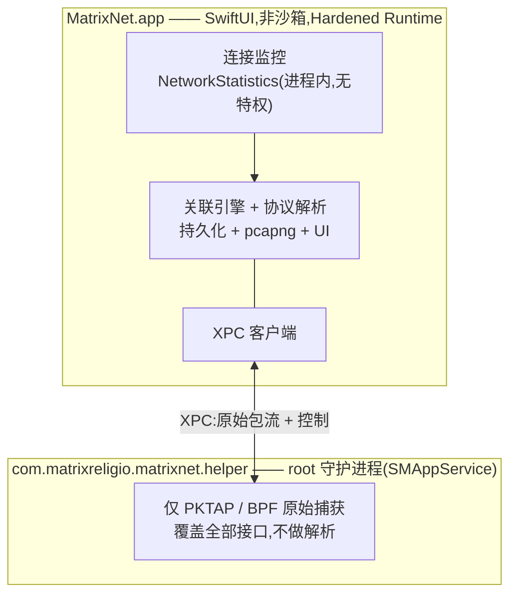

# MatrixNet

[English](./README.md) · **简体中文**

**看清每个 App 正在和哪个 IP 通信 —— 再把任意一条流追到数据包级别。**

一款 100% 原生 SwiftUI 的 macOS 网络监控与深度数据包分析工具。看「谁在上网」像活动监视器一样轻松,看「网线上跑的是什么」像 Wireshark 一样深入 —— 而且每个数据包都知道是哪个 App 发出的。

[](https://github.com/MatrixReligio/MatrixNet/actions/workflows/ci.yml)
[](./LICENSE)
[](#系统要求)
[](https://swift.org)

> **状态:第一阶段,持续开发中。** MatrixNet 仍处于早期阶段。架构已确定,核心库以测试驱动方式构建,连接监控与深度抓包均已在真机跑通并签名公证,但功能尚未完全定型,接口与界面仍可能调整。

---

## MatrixNet 是什么?

十年来,macOS 网络领域由两类工具主导。**Little Snitch** 告诉你「哪个 App」在连向何处;**Wireshark** 让你看到「网线上的每一个字节」—— 却不知道是哪个 App 产生的。MatrixNet 把两者合二为一:上层是按 App 的连接监控,底层是数据包级别的协议解析,中间有一层关联引擎,把每个捕获到的数据包追溯回它所属的进程与连接。

第一阶段严格保持**被动 —— 只观察,绝不拦截**。没有防火墙,不截流量,也不解密 HTTPS(后续规划见[路线图](#路线图))。正因为只观察,MatrixNet 能与你已在使用的任何代理、过滤器或 VPN 并存,互不干扰。

## 功能

### 🔭 连接监控
- 全系统、按 App 的实时连接列表:进程、远端主机/IP、国家/地区、上下行速率、累计字节与连接生命周期。
- 由内核归因进程归属 —— 与 `nettop` 和活动监视器同源的机制 —— 归因准确,无轮询竞争。
- DNS 富化:把观测到的 IP 反查回主机名。
- 连接历史可回溯(「昨天哪个 App 连到了哪里」)。

### 🔬 深度数据包分析
- 逐包捕获,**每个数据包都携带其归属 PID**。
- 扎实解析最关键的协议:**Ethernet、IPv4、IPv6、TCP、UDP、ICMP、DNS、TLS(握手 / SNI / 证书)与 HTTP/1.1**。
- Wireshark 风格的三栏视图:包列表、协议详情树,以及同步的十六进制视图。
- Follow Stream 流重组,以及切分捕获的显示过滤语言。
- 可将数据包过滤到单个 App 或单条连接。
- 将选中数据包或整个会话导出为 **pcapng** —— 含逐包进程元数据 —— 交给 Wireshark。

### 🖥️ 桌面 Widget
- WidgetKit 小组件(小 / 中 / 大尺寸)在桌面或通知中心实时显示活动连接数、上下行吞吐、会话累计流量,以及流量最高的 App。

### 🌍 支持你的语言
- 完整本地化为 **8 种语言** —— 英语、简体中文、繁体中文、日语、韩语、法语、德语、西班牙语 —— 自动跟随你的 macOS 系统语言。翻译完整性由 CI 强制校验。

### 🔄 保持最新
- 通过 [Sparkle](https://sparkle-project.org) 实现**应用内自动更新**,更新包以 EdDSA 签名并由 GitHub Releases 分发。可手动检查,也可后台每日自动检查。
- **GeoIP 数据库自动后台更新**,数据源为按月发布的 DB-IP 数据集,使国家/地区归因长期保持准确。

### 🛡️ 隐私与零冲突
- **设计上零冲突。** MatrixNet 完全被动:不使用任何 NetworkExtension,不占用独占的路由/代理槽位,也从不处于数据包必经路径上。它与 AdGuard、Surge、Little Snitch、LuLu 以及任意 VPN 共存。
- **100% 本地。** 全部处理都在你的机器上完成。数据不出本机,无遥测、无账号、无云端。
- **最小权限。** 连接监控完全无需授权。数据包捕获被隔离在一个仅负责捕获的最小特权 helper 中;对不可信字节的协议解析则在无特权的主 App 内进行。

## 为什么选 MatrixNet?

| | Little Snitch | Wireshark | **MatrixNet(第一阶段)** |
|---|:---:|:---:|:---:|
| 按 App 的连接视图 | ✅ | ❌ | ✅ |
| 数据包级解析 | ❌ | ✅ | ✅ |
| 每个包都知道所属 App | ❌ | ❌ | ✅ |
| 连接 ↔ 数据包关联 | ❌ | ❌ | ✅ |
| 与代理/VPN 共存 | ⚠️ | ✅ | ✅ |
| 原生、轻量的 macOS App | ✅ | ❌ | ✅ |
| 拦截/过滤流量 | ✅ | ❌ | ❌(刻意为之 —— 被动) |

MatrixNet 无意取代防火墙。当你想*理解*本机的网络行为 —— 从按 App 的鸟瞰视角一直深入到字节 —— 又不希望打扰系统上其他正在运行的东西时,它就是你要找的工具。

## 架构

MatrixNet 采用**被动优先、双数据源**设计(内部称「架构 A′」)。两个相互独立的被动来源按 5 元组与 PID 融合:

- **连接层**来自 Apple 私有的 `NetworkStatistics` 框架(`NStatManager*`)—— 即 `nettop` 与活动监视器背后的内核机制。内核把每条连接归因到 PID,并报告 5 元组与字节计数。它无需 root、无需 entitlement、无需 NetworkExtension —— 这正是 MatrixNet 与任何软件都不冲突的原因。
- **数据包层**来自基于 BPF 的 `PKTAP`(`DLT_PKTAP`),它为每个数据包打上其来源 PID。一个无过滤的 pktap 会话即可覆盖全部接口(`en0`、`utun*`、`lo0`)。原始捕获需要 root,因此它运行在一个通过 `SMAppService` 注册的小型特权 helper 中。该 helper *只负责捕获* —— 所有对不可信网络数据的协议解析都回到无特权的主 App 完成。



**为什么不用 NetworkExtension?** 在 macOS 上,把流量归因到进程*并不*需要 NetworkExtension —— 内核已经通过 `NetworkStatistics` 做到了。使用 `NEFilterDataProvider`、`NEPacketTunnelProvider` 或 `NEDNSProxyProvider` 意味着去竞争 socket/路由/DNS 路径上独占且拥挤的槽位,而这正是各类过滤产品之间冲突的根源。对一个监控工具而言,被动的内核观测完美满足零冲突要求。

完整设计、模块依赖图与数据流见 [`docs/ARCHITECTURE.md`](./docs/ARCHITECTURE.md)。

## 系统要求

- **macOS 26(Tahoe)** 或更高版本
- Apple Silicon 或 Intel
- 从源码构建需:**Xcode 26** 与 [XcodeGen](https://github.com/yonaskolb/XcodeGen)

## 安装

从 [GitHub Releases](https://github.com/MatrixReligio/MatrixNet/releases) 页面下载已公证的 `.dmg`,打开后将 MatrixNet 拖入「应用程序」文件夹。构建产物使用 Developer ID 签名并经 Apple 公证,因此 Gatekeeper 不会弹出警告即可打开。安装后,MatrixNet 会自动保持更新 —— 无需再回到此页面。

MatrixNet **不**通过 Mac App Store 分发:BPF/PKTAP 捕获与 `NetworkStatistics` 框架对沙箱 App 不可用。直接的公证分发是刻意的架构取舍,而非疏漏。

## 从源码构建

```sh
# 1. 克隆
git clone https://github.com/MatrixReligio/MatrixNet.git
cd MatrixNet

# 2. 运行纯逻辑核心测试套件(无需 Xcode)
swift test

# 3. 生成 Xcode 工程(App + 特权 helper 目标)
xcodegen generate

# 4. 构建 / 运行 App
open MatrixNet.xcodeproj
```

纯逻辑核心(领域模型、协议解析、pcapng、关联等)是一个本地 Swift Package,用 `swift test` 即可构建与测试。macOS App 与特权 helper 是由 XcodeGen 从 `project.yml` 生成的 Xcode 目标。完整开发流程见 [`CONTRIBUTING.md`](./CONTRIBUTING.md)。

## 权限

MatrixNet 在每一层都只索取*最小*权限,并优雅降级:

- **连接监控 —— 无需任何授权。** 启动 App 即可立刻看到哪些 App 在上网。`NetworkStatistics` 在进程内运行,无需 root、entitlement 或 TCC 弹窗。
- **深度数据包捕获 —— 一次性系统授权。** 原始捕获需要 root,因此 MatrixNet 通过 `SMAppService` 安装一个仅负责捕获的最小 helper 守护进程,需要一次系统批准。若你拒绝或安装失败,所有连接监控功能照常工作,仅数据包捕获被禁用(并提供重试入口)。

helper 的存在仅为满足 BPF/PKTAP 的 root 要求。它不做任何解析 —— 把处理不可信网络字节的工作刻意留在特权进程之外。

## 隐私

MatrixNet 所有处理都在本地完成。它不向外发送任何数据,无遥测、无需账号、不与任何服务器通信。捕获、历史与设置只保存在你的磁盘上。

## 路线图

第一阶段刻意限定为被动监控与分析。后续阶段计划(尚未实现,且不作保证):

- **防火墙 / 拦截** —— 一个可选启用的拦截模式(很可能基于 `NEFilterDataProvider`),并明确提示与其他 socket 层过滤器可能存在的冲突。
- **AI 原生分析** —— 用自然语言查询你的流量,自动检测追踪器 / 异常 / 隐私泄露。
- **HTTPS 解密(MITM)** —— 可选启用的 TLS 拦截以查看明文。
- 远程 / 移动端捕获、规则引擎,以及更广的 Wireshark 式协议覆盖。

## 贡献

欢迎贡献。MatrixNet 以测试优先构建,采用严格并发、SwiftLint/SwiftFormat 与 Conventional Commits。提交 Pull Request 前请阅读 [`CONTRIBUTING.md`](./CONTRIBUTING.md),并留意我们的[行为准则](./CODE_OF_CONDUCT.md)。

安全问题请私下报告 —— 见 [`SECURITY.md`](./SECURITY.md)。

## 许可证

基于 [Apache License 2.0](./LICENSE) 授权。Copyright 2026 MatrixReligio LLC。署名见 [`NOTICE`](./NOTICE)。

## 致谢

MatrixNet 站在那些让网络透明成为常态的工具的肩膀上。感谢 **Wireshark** 与 **tcpdump/libpcap** 项目数十年的协议解析与捕获工作,也感谢 **Little Snitch** 与 **LuLu** 展示了 macOS 上按 App 的网络感知可以是什么样子。

---

问题或反馈:[contact@matrixreligio.com](mailto:contact@matrixreligio.com)
