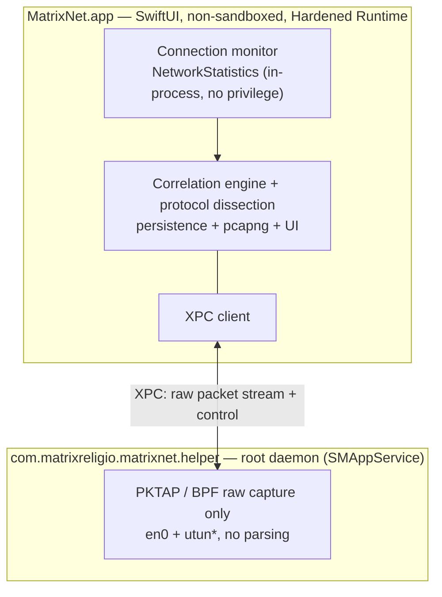

# MatrixNet

[English](./README.md) · [简体中文](./README.zh-CN.md) · **繁體中文** · [日本語](./README.ja.md) · [한국어](./README.ko.md) · [Français](./README.fr.md) · [Deutsch](./README.de.md) · [Español](./README.es.md)

**看清哪個 App 在和哪個 IP 通訊——再把任一條流量一路追到封包。**

一款 100% 原生 SwiftUI 打造的 macOS 網路監控與深度封包分析工具。看 *誰在網路上* 像活動監視器一樣輕鬆,看 *線路上跑著什麼* 像 Wireshark 一樣深入——而且每個封包都知道是哪個 App 送出的。

[](https://github.com/MatrixReligio/MatrixNet/actions/workflows/ci.yml)
[](./LICENSE)
[](#系統需求)
[](https://swift.org)
[](https://github.com/MatrixReligio/MatrixNet/releases/latest)
[](https://github.com/MatrixReligio/MatrixNet/releases)
[](https://github.com/MatrixReligio/MatrixNet/stargazers)
[](https://github.com/MatrixReligio/MatrixNet/commits/main)
[](#安裝)
[](#隱私)
[](#隱私)

> **100% 被動——只觀察,不攔截。** MatrixNet 只讀取內核統計與每個封包的副本,因而能與任何代理、過濾器或 VPN 並存而不衝突。沒有防火牆、不攔截流量、不解密 HTTPS。

---

## MatrixNet 是什麼?

過去十年,macOS 網路由兩款工具主宰。**Little Snitch** 告訴你 *哪個 App* 連往何處。**Wireshark** 讓你看見 *線路上的每一個位元組*——卻不知道是哪個 App 產生的。MatrixNet 把兩者合進一個原生 App:上層是逐 App 的連線監控,下層是封包層級的解析,再加上一層關聯,把每個擷取到的封包,連回它所屬的程序與連線。

MatrixNet 嚴格 **被動——只觀察,不攔截**。沒有防火牆、不攔截流量、也不解密 HTTPS。因為只觀察,MatrixNet 能與你既有的代理、過濾或 VPN 並存,而不互相干擾。

## 功能

### 🔭 連線監控
- 即時 **總覽儀表板**:吞吐曲線(近一分鐘)、關鍵指標(作用中連線、工作階段總量、作用中 App、觸達國家、威脅連線、經代理占比)、通訊協定構成、目的地國家排行,以及強化版的流量排行。
- 全系統、逐 App 的即時連線清單:程序、遠端主機/IP、國家、上下行速率、累計位元組,以及連線生命週期。
- 由核心歸屬的程序擁有者——與 `nettop` 和活動監視器相同的機制——歸屬準確,沒有輪詢競態。
- 由連接埠推斷的 **用戶端/伺服端角色**(這台主機是發起連線,還是接受連線?)。
- **代理與 VPN/通道辨識**——遠端為你設定的或本機代理的連線會被標示,而替其他 App 中繼流量的程序(NetworkExtension 通道)會掛上徽章,讓流量是否被轉送一目了然。
- **威脅 IP 標記**——位於公開威脅情報封鎖清單上的遠端位址,會以 ⚠️ 徽章標示(僅供參考——MatrixNet 只標示,絕不攔截)。
- **新目的地(「phoning home」)提醒**——可選、非阻斷:當某個已知應用程式首次連到從未去過的國家／地區時通知你。每個應用有學習窗 + 限流,保持安靜——這是出站防火牆的洞察,但不攔截、不洗版。
- 從 **TLS SNI 與 DNS** 加值主機名稱——直接從 ClientHello 與 DNS 回應讀取應用程式真正請求的主機名稱,**全程不解密**,並優先於反向 DNS 的 PTR 記錄(後者常是 CDN 萬用網域)。一鍵切換可在連線與封包檢視中顯示 **網域名稱或原始 IP**。
- **地圖分頁** 繪製真實世界的離線點陣地球(Natural Earth,不抓地圖圖磚),從這台 Mac 向每個正在通訊的國家拉出發光弧線——節點大小依連線數,威脅目的地為紅色。
- 可回顧的連線歷史(「昨天哪個 App 連到了哪裡」)。

### 📊 用量報表
- 全新**「用量」標籤頁**,回答「我的流量去哪了」:依位元組統計 **今天 / 近 7 天 / 近 30 天 / 本計費週期** 的 Top 應用程式、國家／地區與網域,並附下載/上傳趨勢圖。
- 以本機逐小時聚合的桶為基礎(預設保留 90 天,可調整),總量在重新啟動後仍會保留——不像活動監視器會歸零。
- 選取某個應用程式即可將國家與網域分解限定於該應用程式;可設定**計費重置日**,讓「週期」範圍與你的方案一致。
- 可將目前時間範圍**匯出**為 CSV 或 JSON,用於報表、對帳或稽核。

### 🔬 深度封包分析
- 逐封包擷取,**每個封包都帶著所屬 PID**。
- 對最重要通訊協定的紮實解析:**Ethernet、IPv4、IPv6、TCP、UDP、ICMP、DNS、TLS(交握 / SNI / 憑證)與 HTTP/1.1**。
- **JA4 TLS 用戶端指紋(依 App)** —— 不解密,從 ClientHello 被動推斷每個 App 的 TLS 堆疊(瀏覽器引擎 / Go / curl / 可疑程式庫);顯示於 TLS 層與連線檢視器,已辨識的堆疊會標註。
- **HTTP/3 / QUIC 可見性** —— 被動解密 QUIC Initial(RFC 9001 的公開 DCID 派生金鑰,無需機密、不中間人)讀出每條 HTTP/3 連線的 SNI、ALPN、版本,並算出 QUIC JA4,全部依 App 歸屬。
- **依應用網路品質** —— 被動量測每條 TCP 連線的交握 RTT、重傳與連線建立時長,顯示於連線檢查器(僅抓包時、不送探測封包)。
- **依應用加密 DNS** —— 從 5 元組與主機名判定每個應用用的是明文 DNS 還是 DoT/DoQ/DoH(並標出解析器),無需抓包。
- **依應用活動時間軸** —— 從已儲存用量為每個應用繪製一條活動熱力條(按小時或天),背景/夜間活動一目了然。
- Wireshark 風格的三窗格檢視:封包清單、通訊協定明細樹,以及同步的十六進位檢視。
- 追蹤串流重組,以及切分擷取內容的顯示過濾語言。
- 把封包縮小到單一 App 或單一連線。
- 將選取的封包或整段工作階段匯出為 **pcapng**——含逐封包的程序中繼資料——交給 Wireshark。

### 🖥️ 桌面小工具
- WidgetKit 小工具(小 / 中 / 大)即時顯示作用中連線數、上下行吞吐、工作階段總量、最忙的 App,以及威脅命中數——就在桌面或通知中心。

### 🧭 選單列與背景執行
- 常駐 **選單列**,即時顯示 ↓/↑ 吞吐,並在你關閉主視窗後持續監控——讓桌面小工具永不過時。
- 可選的 **僅選單列模式** 會完全隱藏 Dock 圖示。
- **登入時啟動** 與 **設定視窗**(⌘,),可設定背景模式、威脅連線通知、自動檢查更新,以及隨選重新整理資料集。
- **威脅連線通知**——當作用中連線觸及被標記的位址時提醒你(僅供參考;MatrixNet 絕不攔截)。

### 🌍 說你的語言
- 完整在地化為 **8 種語言**——英文、簡體與繁體中文、日文、韓文、法文、德文、西班牙文——自動跟隨 macOS 系統語言。翻譯涵蓋率由 CI 強制檢查。

### 🔄 保持最新
- 透過 [Sparkle](https://sparkle-project.org) 的 **App 內自動更新**,以 EdDSA 簽署的更新由 GitHub Releases 提供。可隨選檢查,或每日於背景檢查。
- **GeoIP 資料庫自動更新**——於背景從每月的 DB-IP 資料集更新,讓國家歸屬隨時間保持準確。它同時涵蓋 **IPv4 與 IPv6** 目標位址,因此地圖與國家指標不會少計 IPv6 流量。
- **威脅 IP 清單也以相同方式自動更新**——來自公開的 IPsum 匯整;App 僅會存取自己的發行資源,絕不連向上游來源。

### 🛡️ 隱私與零衝突
- **設計上零衝突。** MatrixNet 完全被動:不使用 NetworkExtension、不佔用任何獨佔的路由/代理位置,也不介入封包路徑。它能與 AdGuard、Surge、Little Snitch、LuLu 及任何 VPN 共存。
- **100% 本機。** 所有處理都在你的機器上完成。沒有資料離開裝置。無遙測。無帳號。無雲端。
- **最小權限。** 連線監控完全不需授權。封包擷取被隔離在一個最小、僅負責擷取的輔助程式中;對不可信位元組的通訊協定解析,則在無特權的 App 內執行。

## 為什麼選 MatrixNet?

| | Little Snitch | Wireshark | **MatrixNet** |
|---|:---:|:---:|:---:|
| 逐 App 連線檢視 | ✅ | ❌ | ✅ |
| 封包層級解析 | ❌ | ✅ | ✅ |
| 每個封包都知道所屬 App | ❌ | ❌ | ✅ |
| 連線 ↔ 封包關聯 | ❌ | ❌ | ✅ |
| 與代理/VPN 共存 | ⚠️ | ✅ | ✅ |
| 原生、輕量的 macOS App | ✅ | ❌ | ✅ |
| 攔截/過濾流量 | ✅ | ❌ | ❌(刻意為之——被動) |

MatrixNet 不打算取代防火牆。當你想 *理解* 機器的網路行為——從逐 App 的鳥瞰一路到位元組——而又不干擾系統上其他任何東西時,它就是你會拿起的工具。

## 架構

MatrixNet 採用 **被動優先、雙來源** 的設計(內部稱為「架構 A′」)。兩個獨立的被動來源,以五元組與 PID 融合:

- **連線層級** 來自 Apple 私有的 `NetworkStatistics` 框架(`NStatManager*`)——也就是 `nettop` 與活動監視器背後的核心機制。核心會把每條連線歸屬到 PID,並回報五元組與位元組計數。它不需要 root、不需要 entitlement、也不需要 NetworkExtension,這正是 MatrixNet 與任何東西都不衝突的原因。
- **封包層級** 來自 BPF 之上的 `PKTAP`(`DLT_PKTAP`),會替每個封包標上來源 PID。當 VPN 啟用時,MatrixNet 會同時擷取實體介面(`en0`)與通道(`utun*`)。原始擷取需要 root,因此放在一個以 `SMAppService` 註冊的小型特權輔助程式中。輔助程式 *只負責擷取*——所有對不可信網路資料的通訊協定解析,都回到無特權的主 App 進行。



**為什麼不用 NetworkExtension?** 在 macOS 上,把流量歸屬到程序 *並不* 需要 NetworkExtension——核心已透過 `NetworkStatistics` 做到了。改用 `NEFilterDataProvider`、`NEPacketTunnelProvider` 或 `NEDNSProxyProvider`,等於在 socket/路由/DNS 路徑上爭搶獨佔且競用的位置,而這正是各家過濾產品衝突的已知來源。對監控工具而言,被動的核心觀察完美滿足零衝突的需求。

完整設計、模組相依圖與資料流,請見 [`docs/ARCHITECTURE.md`](./docs/ARCHITECTURE.md)。

## 系統需求

- **macOS 26(Tahoe)** 或更新版本
- Apple Silicon 或 Intel
- 從原始碼建置需要:**Xcode 26** 與 [XcodeGen](https://github.com/yonaskolb/XcodeGen)

## 安裝

從 [GitHub Releases](https://github.com/MatrixReligio/MatrixNet/releases) 頁面下載已公證的 `.dmg`,開啟後把 MatrixNet 拖進「應用程式」資料夾。建置以 Developer ID 簽署並經 Apple 公證,因此 Gatekeeper 會直接開啟、不跳警告。安裝後 MatrixNet 會自動保持最新——不必再回到這個頁面。

MatrixNet **不** 透過 Mac App Store 發布:BPF/PKTAP 擷取與 `NetworkStatistics` 框架無法用於沙箱 App。直接、公證的發布是刻意的架構結果,而非疏忽。

## 從原始碼建置

```sh
# 1. 複製儲存庫
git clone https://github.com/MatrixReligio/MatrixNet.git
cd MatrixNet

# 2. 執行純邏輯核心測試套件(不需 Xcode)
swift test

# 3. 產生 Xcode 專案(App + 特權輔助程式目標)
xcodegen generate

# 4. 建置 / 執行 App
open MatrixNet.xcodeproj
```

純邏輯核心(領域模型、解析、pcapng、關聯等)是一個本機 Swift 套件,只要 `swift test` 就能建置與測試。macOS App 與特權輔助程式,則是由 XcodeGen 依 `project.yml` 產生的 Xcode 目標。完整開發流程見 [`CONTRIBUTING.md`](./CONTRIBUTING.md)。

## 權限

MatrixNet 在每個層級都只要求 *最小* 權限,並優雅地降級:

- **連線監控——不需任何授權。** 啟動 App 就能立刻看到哪些 App 在網路上。`NetworkStatistics` 於行程內執行,不需 root、entitlement 或 TCC 提示。
- **深度封包擷取——一次性的系統授權。** 原始擷取需要 root,因此 MatrixNet 會透過 `SMAppService` 安裝一個最小、僅負責擷取的輔助常駐程式,需要一次系統核准。若你拒絕或安裝失敗,所有連線監控功能仍可運作,僅封包擷取會停用(並附重試提示)。

輔助程式存在的唯一目的,就是滿足 BPF/PKTAP 的 root 需求。它不做任何解析——處理不可信網路位元組這件事,刻意留在特權程序之外。

## 隱私

MatrixNet 全部在本機處理。它不會把任何資料送出你的機器、沒有遙測、不需帳號,也不與任何伺服器通訊。擷取內容、歷史與設定只存在你的磁碟上。

## 版本號

MatrixNet 遵循[語意化版本](https://semver.org/lang/zh-TW/):**主版本號.次版本號.修訂號**。

- **主版本號(MAJOR)**——不相容的變更,或 App 定位的根本性轉變。
- **次版本號(MINOR)**——向後相容的新功能。
- **修訂號(PATCH)**——向後相容的缺陷修正。

每個版本都經過公證並透過 App 內更新分發。各版本變更詳見 [CHANGELOG](./CHANGELOG.md)。

## 參與貢獻

歡迎貢獻。MatrixNet 以測試優先、嚴格並行、SwiftLint/SwiftFormat 與 Conventional Commits 建構。提出 pull request 前,請先閱讀 [`CONTRIBUTING.md`](./CONTRIBUTING.md),並留意我們的 [行為準則](./CODE_OF_CONDUCT.md)。

資安問題請私下回報——見 [`SECURITY.md`](./SECURITY.md)。

## 授權

採用 [Apache License 2.0](./LICENSE) 授權。Copyright 2026 MatrixReligio LLC。署名見 [`NOTICE`](./NOTICE)。

## 致謝

MatrixNet 站在那些讓網路透明成為常態的工具的肩膀上。感謝 **Wireshark** 與 **tcpdump/libpcap** 專案數十年的通訊協定解析與擷取工作,也感謝 **Little Snitch** 與 **LuLu** 示範了 macOS 上逐 App 的網路感知可以是什麼樣子。

隨附資料:國家地理定位來自 [DB-IP](https://db-ip.com)(CC-BY-4.0)、威脅 IP 清單衍生自 [IPsum](https://github.com/stamparm/ipsum)(公有領域),地圖分頁的世界幾何來自 [Natural Earth](https://www.naturalearthdata.com)(公有領域)。完整署名見 [`NOTICE`](./NOTICE)。

---

問題或建議:[contact@matrixreligio.com](mailto:contact@matrixreligio.com)
