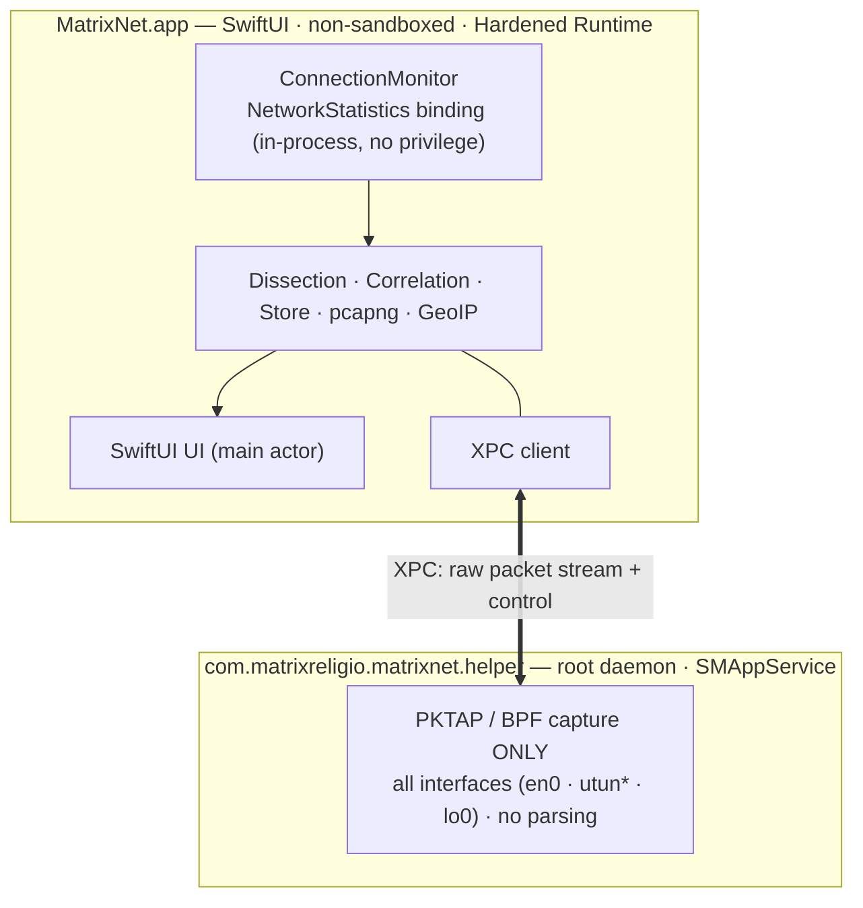
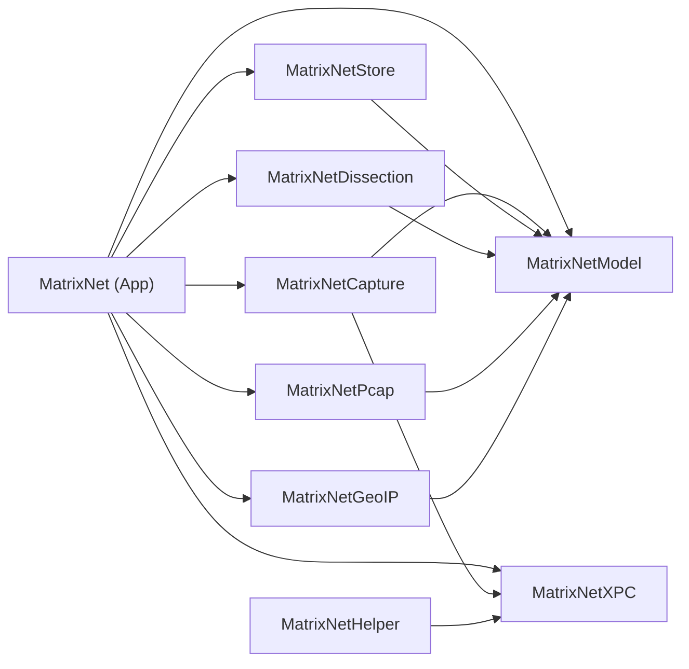
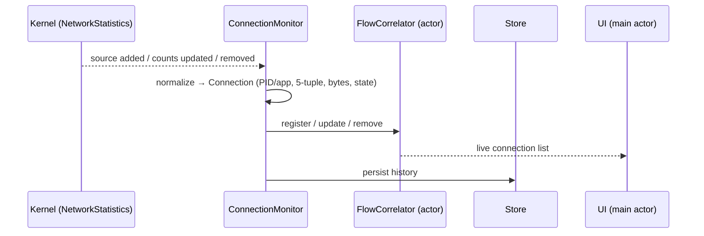
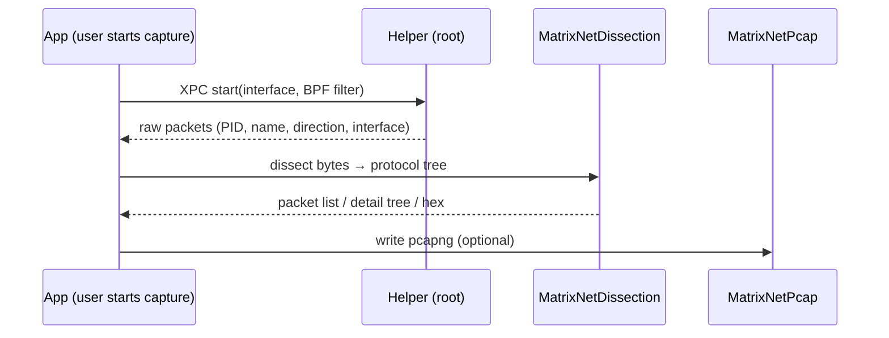

# MatrixNet Architecture

> Contributor-facing overview of MatrixNet's Phase 1 design.
> **Status: work in progress.** The architecture is settled; the implementation
> is being built out test-first, module by module.

This document explains *how* MatrixNet is put together and *why*. For the product
overview, see the [README](../README.md). For the contribution workflow, see
[CONTRIBUTING](../CONTRIBUTING.md).

## Design goals

MatrixNet must deliver two things at once:

1. **Per-app connection monitoring** — like Activity Monitor, but focused on the
   network: which app is talking to which host, how much, and for how long.
2. **Packet-level analysis** — like Wireshark, but where every packet is
   attributed to the app that produced it.

…under two hard constraints:

- **Zero conflict.** MatrixNet must run alongside any proxy, content filter, or
  VPN (AdGuard, Surge, Stash, Loon, Little Snitch, LuLu, etc.) without competing
  with it.
- **Least privilege.** Ask for the minimum authorization at each layer, and keep
  the handling of untrusted data out of any privileged process.

Phase 1 is **strictly passive**: observe, never block, never decrypt.

## Architecture A′: passive-first, dual-source

MatrixNet fuses two independent, passive observation sources, keyed by 5-tuple
and PID.

| Source | Mechanism | Privilege | Gives us |
|---|---|---|---|
| Connection level | `NetworkStatistics` (`NStatManager*`) — the kernel mechanism behind `nettop` / Activity Monitor | None (in-process) | Per-connection PID attribution, 5-tuple, byte/packet counters, lifecycle |
| Packet level | `PKTAP` (`DLT_PKTAP`) over BPF | root (isolated helper) | Raw packets, each tagged with its originating PID and direction |

### Why no NetworkExtension

A common assumption is that per-process traffic attribution on macOS requires a
NetworkExtension. It does not. The kernel already attributes each connection to a
PID via `NetworkStatistics`, with no root, entitlement, TCC prompt, or polling
race. That removes the only real reason a monitoring tool would reach for
`NEFilterDataProvider`.

Going the NetworkExtension route would also actively work against the
zero-conflict constraint:

- `NEFilterDataProvider` shares the socket-filter layer with other filters
  (documented incompatibilities exist between filtering products), adds
  head-of-line latency when several are chained, and requires an entitlement, a
  system extension, and user approval.
- `NEPacketTunnelProvider` and `NEDNSProxyProvider` are exclusive,
  contended resources — using them means *taking over* routing or DNS, which is
  the opposite of coexisting passively.

**Conclusion: Phase 1 uses zero NetworkExtension, zero system extensions, and
zero entitlements.** Optional blocking, if it ships, will be a later, opt-in
`NEFilterDataProvider` mode with an explicit conflict warning — never a
requirement for the monitoring core.

## Two-process model

- **Connection monitoring lives in the main app.** `NetworkStatistics` needs no
  privilege, so the moment the app launches you can see who is on the network —
  the first screen has value with zero setup.
- **Packet capture lives in a root helper, and the helper only captures.** Raw
  BPF/PKTAP access requires root, so capture is isolated in a tiny daemon
  registered via `SMAppService`. Crucially, **all protocol parsing happens back in
  the unprivileged app** — the attack surface of parsing untrusted network bytes
  must never run as root.
- The two processes communicate over **XPC**: the app sends control commands
  (start/stop, interface selection, BPF filter); the helper streams raw packets
  (with per-packet PID, process name, direction, and interface) back.

### PKTAP capture recipe (verified on macOS 26)

`pktap` is a *cloning* pseudo-interface, and getting per-packet process
attribution from it requires a specific, non-obvious sequence (cross-checked
against Apple's open-source `libpcap`/`pcap-darwin.c` and `xnu`
`bsd/net/bpf_private.h`, then confirmed on-device):

1. **Create** a `pktap` instance with `SIOCIFCREATE` — the kernel returns the
   unit name (e.g. `pktap0`). Binding BPF to the bare name `pktap` fails with
   `ENXIO`. Destroy it with `SIOCIFDESTROY` on teardown.
2. Open `/dev/bpfN`, enlarge the buffer (`BIOCSBLEN`), then set
   **`BIOCSWANTPKTAP = 1`** *before* binding — without it the kernel delivers
   plain `DLT_RAW` with no process info.
3. `BIOCSETIF` the created interface; the kernel then reports link type **149**
   (its internal pktap DLT, not libpcap's userspace `258`), so `BIOCSDLT(258)`
   returns `EINVAL` and is intentionally ignored.
4. A single, unfiltered pktap taps **all** interfaces at once (`en0`, `utun*`,
   `lo0`), each packet prefixed with a `pktap_header` carrying the PID and
   process name — so no separate `en0` + `utun*` double-capture is needed.

See `docs/superpowers/notes/capture-spike.md` for the measured evidence.

## Modules

The pure-logic core is a local Swift Package (`MatrixNetCore`, see
[`Package.swift`](../Package.swift)) so it can be developed and tested with plain
`swift test`, without Xcode. The app and helper are Xcode targets generated by
XcodeGen from `project.yml` and depend on these libraries.

| Module | Kind | Responsibility | Testability |
|---|---|---|---|
| `MatrixNetModel` | SwiftPM lib | Domain model (`Connection`, `Packet`, `AppIdentity`, `FiveTuple`/`FlowKey`, protocol tree) + the 5-tuple/PID correlation engine (`FlowCorrelator`) | Pure logic — high |
| `MatrixNetDissection` | SwiftPM lib | Protocol parsers (pure functions: bytes → protocol tree) + Follow Stream reassembly | Golden pcaps — high |
| `MatrixNetPcap` | SwiftPM lib | pcapng read/write (export/import replay, incl. PKTAP process metadata blocks) | Round-trip — high |
| `MatrixNetCapture` | SwiftPM lib | Capture abstractions: `ConnectionMonitoring` / `PacketCapturing` protocols, the NetworkStatistics binding, and the helper XPC client. **Private-framework binding is isolated here.** | Protocols mockable |
| `MatrixNetStore` | SwiftPM lib | Persistence (SwiftData connection history + on-disk pcap ring-buffer management) | Medium |
| `MatrixNetGeoIP` | SwiftPM lib | Local GeoIP lookup (permissively licensed database) | High |
| `MatrixNetXPC` | SwiftPM lib | The shared XPC protocol contract between app and helper | Contract tests |
| `MatrixNetHelper` | Xcode target | The root helper daemon (PKTAP capture) | Integration |
| `MatrixNet` (App) | Xcode target | SwiftUI interface layer | UI / snapshot |

### Dependency direction (acyclic)

Rules: `App` → everything; the capability libraries → `Model`; `Capture` and
`Helper` → `XPC`. There are no cycles. Logic that *can* live in a pure module
*should* — keep it out of the app and the helper so it stays testable.

## Data flow

### 1. Connection level

`NStatManager` delivers streaming callbacks (source added, counter updates,
source removed). `ConnectionMonitor` normalizes them into `Connection` values.
Counters are applied with `Connection.updateCumulativeCounts(...)`, which clamps
them to be monotonic (a stale, smaller sample never lowers a counter) and only
advances `lastActivityAt` when the counters actually grow, so idle refreshes do
not mark a connection active.

### 2. Packet level

When the user enables capture, the app asks the helper (over XPC) to start PKTAP
with a kernel-side BPF filter. The helper streams raw packets — each carrying its
PID, process name, direction, and interface — back to the app, where
`MatrixNetDissection` turns the bytes into a protocol tree for the list / detail /
hex view, and `MatrixNetPcap` can persist them as pcapng.

### 3. Correlation

The `FlowCorrelator` actor in `MatrixNetModel` ties the two sources together. A
`FiveTuple` exposes a direction-insensitive `FlowKey` (the two endpoints are
canonically ordered), so a captured packet and the kernel-reported connection it
belongs to produce the *same* key regardless of direction. Packet resolution is:

1. match the packet's `FlowKey` to a registered connection, else
2. fall back to the most recent live connection for the packet's PID.

This yields the unified "this app's connections + its raw packets" view. The
correlator is an `actor` precisely because both sources feed it concurrently at
high rate (see [Concurrency](#concurrency-model)).

### 4. DNS enrichment

`NetworkStatistics` reports remote IPs, not hostnames. MatrixNet builds an
`IP → hostname` table from observed DNS responses (`FlowCorrelator.recordHostname`)
and backfills `Connection.remoteHostname`, so the connection view can show
meaningful names.

## Concurrency model

MatrixNet builds in **Swift 6 strict concurrency**. The isolation strategy:

- **UI on the main actor.** All SwiftUI state updates happen there.
- **Capture ingest and correlation on background actors.** The `FlowCorrelator`
  is an `actor`; high-rate ingestion from both sources is serialized through it
  without data races.
- **Dissection off the main actor.** Parsing runs on background actors so a burst
  of packets never blocks the UI.
- **Backpressure and bounded memory.** Large flows are handled with list
  virtualization, a capture ring buffer with size/time caps, and BPF kernel-side
  filtering to drop uninteresting traffic before it ever reaches user space.

This is also the area with the most demanding tests — concurrent dual-source
ingestion, lifecycle interleaving, and PID reuse are covered under
ThreadSanitizer. See [CONTRIBUTING](../CONTRIBUTING.md#test-coverage-expectations).

## Private-framework risk and isolation

`NetworkStatistics` is a private framework, so its symbols can change or
disappear across major macOS releases. Mitigations:

- **Isolation.** All binding to `NetworkStatistics` lives behind the
  `ConnectionMonitoring` protocol in `MatrixNetCapture`. The rest of the codebase
  depends on the protocol, not the framework, so the blast radius of a break is
  one module.
- **Graceful degradation.** If the private symbols fail to resolve on a new OS,
  the module reports the failure and the app degrades (connection monitoring may
  be reduced, e.g. supplemented by `proc_pidfdinfo`) rather than crashing.
- **Cross-version CI.** The capture layer is regression-tested across major OS
  versions so breakage surfaces early.

The PKTAP/VPN attribution edge (outer `en0` encrypted view vs. inner `utun*`
plaintext view) is verified against real hardware, since attribution differences
between the layers can only be confirmed on-device.

## Signing and distribution

- The app and helper are both built with **Hardened Runtime**, signed with a
  **Developer ID**, and **notarized** by Apple.
- The helper is registered via `SMAppService`, and its signing identity (Team ID
  + bundle identifier) is validated at registration time.
- **App Sandbox is not enabled** — the `NetworkStatistics` control socket
  (`PF_SYSTEM`) and BPF require capabilities unavailable to sandboxed apps. This
  is also why MatrixNet is distributed **outside the Mac App Store**, via
  notarized `.dmg` on GitHub Releases (and possibly a Homebrew cask).
- **No NetworkExtension entitlement** is requested — Architecture A′ does not use
  NetworkExtension.

## Testing strategy

Testing uses Apple's **Swift Testing** framework (`@Test`, `#expect`, `#require`,
parameterized `@Test(arguments:)`, `confirmation`, `@Suite`, `.timeLimit`),
falling back to XCTest only where Swift Testing does not yet cover a case. The two
focus areas:

- **Boundary / malformed input** against every dissector — truncation at each
  header boundary, length-field overflow, illegal version/protocol numbers,
  out-of-bounds or self-referential TLVs, fragmentation edges, sequence
  wraparound, reordering, and fuzz-style mutated input. Invariant: no crash, no
  infinite loop, no out-of-bounds read — return a partial parse or an explicit
  error. Run under AddressSanitizer.
- **Concurrency / races** in the ingest and correlation actors under concurrent,
  high-rate dual-source ingestion, including lifecycle interleaving and PID
  reuse. Run under ThreadSanitizer in a dedicated CI job.

Integration tests cover `ConnectionMonitor` against recorded/mocked NStat
callbacks and the helper XPC contract (encode/decode round-trip, disconnect /
reconnect, permission-missing degradation). End-to-end checks on real hardware
verify per-app attribution, that exported pcapng opens in Wireshark, and correct
dual-capture under a live VPN.

CI (GitHub Actions) runs: build + SwiftLint + SwiftFormat checks + the unit and
integration suites + a dedicated ThreadSanitizer job + a coverage report with a
threshold gate. The release workflow handles signing and notarization.

## Milestones

Phase 1 is delivered incrementally:

- **M1** — Connection monitoring usable (NStat + connection table + history).
- **M2** — Capture + dissection (helper + PKTAP + dissectors + three-pane UI).
- **M3** — Correlation + Follow Stream + pcapng export + DNS enrichment.
- **M4** — Polish (map / menu bar / onboarding) + signing/notarization + CI +
  documented release.

## See also

- [README](../README.md) — product overview, features, install.
- [CONTRIBUTING](../CONTRIBUTING.md) — dev environment, TDD, style, PR process.
- [SECURITY](../SECURITY.md) — security design principles and disclosure.
